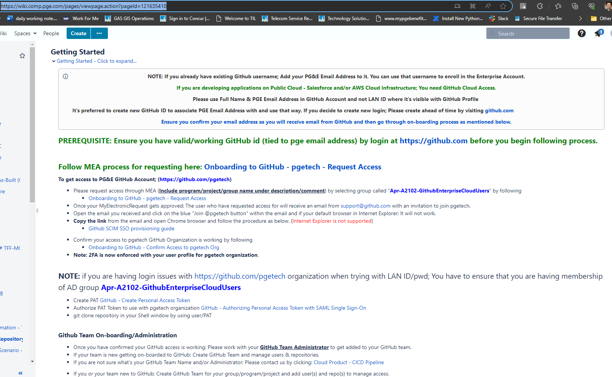
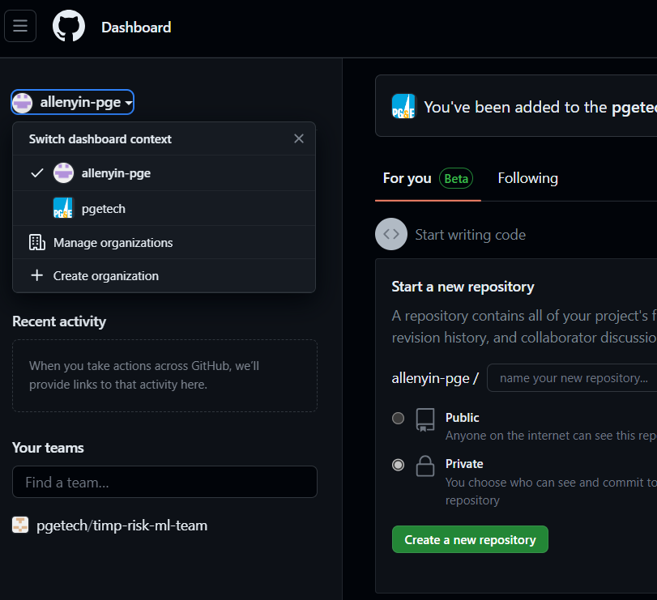

Sometimes summary, sometimes notes, anything I want to document and refer to later...hopefully more of my notes get digitized as well.

# 6/20/2023

## Meeting with Ian to establish expectations and understand goals

- Improve risk assessment model such that field engineers trust its results more.
- Provide evidence to SME that ML-models can be more reliable than the current model, while being interpretable.
  - Important to make the model outputs easy to understand (i.e. probability numbers are hard to interpret)
- Provide data quality assessment: give quantification and evidence to support additional data collection to improve models.

Expectations is I do anything to improve upon these axes.

__Other learnings__:
- Gordon Ye's data team understands how the data is collected and ingested into the current model -- important to work with them.
- Third-party damage (TPD) is the most prevalent type...but also the most difficult to model (many stochastic elements!)
- Record keeping is much better in 2011-2022. Prior to that not so much. Data not always in the same system, pipeline specs are in the same system though.
  - Ian to send excel sheet with location of the different data sources: [TIMP Dataset 2023](https://pge-my.sharepoint.com/:x:/p/tla3/EZaR-HD8-UlNmlSqlbrXdZoBeBC1ZeFU0tmqQsyM39KMpQ?e=gJipuR).
- Many documents on the Teams-Files page

## Palantir Foundry

- Ontology can be used to integrate all data sources in one place
  - Challenge: Setting up the workflow for everyone to use it, really need support from Gordon's team -- how to drive this?
    - Learn what they want to do, how can Foundry make this easier, at least more than their existing solutions?
- Code Workbook similar to Jupyter notebook + REPL, but has limited capability for using custom code.
  - Require Code Repository to use custom code.

#TODO: Check out Even's models inside Foundry..to understand how he cleans and integrate the data there.

## 4810S reading

Finished..see [doc_reading_notes](./doc_reading_notes.md).

## Next on TODOs:

1. Dev tooling setup:
   - Finish following the internal wiki on bitbucket/git code repos (necessary)?
   - Ask Even about his new workflow maybe
   - Prototype on laptop (Jupyter + Python + git) vs. Foundry Code Workbook/Repo?
2. Read attachment 3 on current risk model
   - How to find this year's results and replicate it?
3. Set up meeting with Even toward end of this week
   - ~~Read Even's machine learning notes on Teams~~
4. Set up meeting with Gordon/Steve Lu for next week?
   - Find and read Gordon's roadmap doc
5. Start a doc for my own roadmap, clean up stuff in [planning.txt](./planning.text).

# 6/21/2023

## Gas Data Management

Asset Knowledge Management team working on data quality work, using Foundry ontology layers and GIS layers..can be useful. Useful names:

- Gary Singh
- Kim Jackson
- Alec McCullick
- Susan Minarcin

#TODO: Figure out how they relate to Gordon's team (he's a customer?) and state of data ontology transformation..

[slides](https://pge.sharepoint.com/:p:/s/GasOperationsDataAssetManagement/ETvuD9ysKtVMvV5lGKulRlQBGQnzo5hX3r33Iw7X17hwxQ?e=LGaIg0&isSPOFile=1&clickparams=eyJBcHBOYW1lIjoiVGVhbXMtRGVza3RvcCIsIkFwcFZlcnNpb24iOiIyNy8yMzA1MTQwMTgyMyIsIkhhc0ZlZGVyYXRlZFVzZXIiOmZhbHNlfQ%3D%3D)


# 6/22/2023

- Reading the attachment3 model -- many layers of equations, temporal dependence encapsulated through mitigation factors depending on pipeline assessment events, OR-Gate models, etc.
- Overarching question is...why not a single or even multiple regression models fitted to data?

__Meeting with Brian Patrick__

- Discussed questions about the attachement 3 model, a lot of historical context:
  - Relative modeling previously resulted in the form of the current model equations. Relative modeling combines various "scores" to form "index" representing relative risks (e.g. pipeline1 has higher risk than pipeline2) that then gets converted into likelihood...the scale can be screwed up due to SME's faulty perception of log vs. linear scale.
  - Ajustment and improvement of the current model probably has reached its peak...
- Obstacles encountered toward data-driven approaches:
  - Model tuning driven by SME -- cultural resistance
  - Data cleaning/scrubbing, getting close now.
    - Need to get other groups to input data correctly, requires a lot of engineering time for the data to be usable.
    - Had to help a lot of groups to set up database and push things through.
- Missing historical data -- unclear for old pipes without previous inspection data when corrosion might've started... (leverage existing literature data? Run experiments?)
- __Strategy Advice__:
  - Cleaning data and automating the data ingestion process from the source groups can improve a lot, but can be a huge time sink.
  - Demonstrating improvements using data-driven approaches can help convince getting more buy-in and resources into the effort.
  - Makes sense to prioritize modeling over data cleaning, especially since TIMP has somewaht reliable dataset (Gordon Ye's team..)


#TODO:
- Make sure I understand attachement 3 model data-flow...make a flow chart and ask if I understand it correctly...
- Modeling questions:
  - Is causal dependence important for modeling? How much dependence? How important is using __Fault Tree__?
  - Can I throw everything into GAM? Hierarchical logistic regressions? Or just a single logistic regression FB style?
  - Ask about previous attempts at using Bayesian Networks (and Fault Tree?)...data issue?
  - How about Random Forest? 


- Good references:
  - Dynamic Bayesian Network (DBN) for pipeline corrosion risk modeling [here](https://oaktrust.library.tamu.edu/bitstream/handle/1969.1/174151/PALANIAPPAN-THESIS-2018.pdf?sequence=1&isAllowed=y)
  - Predicting pipeline failure using Gradient Boosted Trees (GBT) and weighted risk analysis [paper](https://www.nature.com/articles/s41545-022-00165-2) 


# 6/23/2023

## Trying to setup work flow

Foundry:
  - Get access through [MEA](https://sailpointui.utility.pge.com/identityiq/home.jsf), then log into [Palantir Foundry](https://damask.palantirfoundry.com/workspace/home/). Repos/projects requires access to be granted.

Bitbucket: Is deprecated. The wiki [here](https://wiki.comp.pge.com/display/DAF/Tool+Installation) lies.

Git:
  - Supposedly there are instructions on the wiki page [here](https://wiki.comp.pge.com/pages/viewpage.action?pageId=121635410), but I need to log-in, which I can't.
  - Can follow the screenshot below
  - Go to github and create an account with the pge email address. Note that using the `<fullname>@pge.com` doesn't work, I never got the confirmation code that way. So use `<lanID>@pge.com` instead for email, even though the screenshot recommended the first way.
  - Then request access through MEA to join the group `Apr-A2102-GithubEnterpriseCloudUsers ` and enter in the details something like "My group is TIMP, project is CE"...hopefully they approve access. WTF why is it so hard to access a git repo?!

  

  # 6/26/2023

  ## Accounts:

  All the github and wiki requests have been approved.

  ### Git:
  - Click on the email that invited to join `pgetech` github project.
  - Set up 2fac with Microsoft Authenticator app on the phone.
  - Follow steps on the wiki page [here](https://wiki.comp.pge.com/display/CCE/GitHub+-+Create+Personal+Access+Token) to generate personal authentication token and use for PGE SSO -- remember to rotate token every 90 days!!!
  - Join the `TIMP Risk ML-Team` on github: click on `pgetech` organization from profile (see screenshot), then `view organization` -> `Teams` -> `Search` for "TIMP" to join.
  
  - One of the team members will grant access.
  - Now we can see all the repositories belonging to the team [here](https://github.com/orgs/pgetech/teams/timp-risk-ml-team/repositories).

  ### Powershell and VSCode

  PGE has weird regulations for laptop, extra hacks have to get around these things...

  1. Install `git` and `vim` via `itstore` -- chose `github git` and `gvim` -- wait for all that to finish.
  2. Set Powershell alias:
      - First create the powershell profile: `new-item -type file -path $profile -force`
      - Set `vim` as default editor (could be notepad): `set-alias vim 'C:\Program Files (x86)\Vim\vim80\vim.exe'`
      - Do `vim $profile` and enter the following:
      ```
      set-alias vim 'C:\Program Files (x86)\Vim\vim80\vim.exe'
      set-alias l 'ls'
      set-alias c 'clear'

      function u { set-location .. }
      function src { . $profile }
      function rc { vim $profile }
      ```
  3. Do basic vim settings ...unfortunately I can't edit the `vimrc` settings in `$VIM` (in program files), and this makes me very frustrated.

# 6/27/2023

## More git stuff

- Setting up workflow -- decided to do most code and editting through VSCode.
- PGE restrictions are really annoying, couldn't use VSCode's github integration shown [here](https://code.visualstudio.com/docs/sourcecontrol/overview#_3way-merge-editor) because it required downloading VSCode updates!
- Go to all the steps outlined [here](https://docs.github.com/en/get-started/getting-started-with-git/setting-your-username-in-git), but do all of them in powershell using `git` instead of through `git-bash` application, they don't work otherwise.

Apparently pgetech github doesn't allow repos to be forked, so I gitcloned all the team's repos [here](https://github.com/orgs/pgetech/teams/timp-risk-ml-team/repositories), and pushed them into my own personal repos. Why not branch then push? Because easier to refer back to that state this way. I referred to this [link](https://stackoverflow.com/a/6035062) for setting it up. Notably the command: `git remote set-url origin git@github.com:yourname/SecondProject.git` to set the cloned repository to link to my personal repo.

## Meeting with Jackson + Gordon + Ian

__Goals__: Understand current risk model and data input to it

Some important takeaways:

> Big problem with current risk modeling approach is looking at only bad stuff, and not when things are good. Want a way to extrapolate modeling to all pipelines.
  - Yes this makes sense, but sparse event modeling is hard.

How much historical dataset is readily available?
- Data quality improved a lot in last 10 years, as well as modeling, so hard to compare historically.
- MOre reilably data include:
  - __ILI__
  - __Pipe specification__: though knowledge about the same pipe may change over time, and this is not backfilled to previous dataset.
  - __Dig data__: For mitigation of incidents, these data are very detailed and accurate.
- Jackson: Furthest back reliable data probably to 2017/2018. Since in 2015 data collected started becoming quantitative.

Remark: There is maybe up to 7-10 years of usable historical data available, with very small number of incidents occurence. How to best leverage this? Build temporal dataset? ANCOVA?

__Dataset availability__
- Ask Gorden/Steven Liu for questions on dataset, data columns, etc.
- Risk assessment data in __Mariner Sql Database__, with archives of tables from past years.
  - Data description conforms to attachment 3 variable names.
  - RMI (risk managmenet instructions) contains risk factor overview docs, they are [here](//ffshare01-nas/RiskMgmt/RISK%20THEMES/2022/2022%20Risk%20Assessment/RMI-02/).

__Consensus on key problem__

- How to compare model performances?
- Need a good measurement of risk that fits w/ SME's understanding
  - Interpretable in terms of risk
- How to prove that risk is going down, even when time is against us?

Gordon suggests that __likelihood__ estimation has room for improvements (as supposed to consequence part of the risk equation), and that more fine-tuned risk __likelihood scale and meaning__ would be useful.

How to measure model performance?
- Incidents, dig information can be proxy.
- ILI

In general, model validation needs to be based on very sparse measurement data, making it difficult.

__Desired improvements__
- Outlined in Gordon's risk model roadmap.
- Want risk modeling to be more predictive rather than reactive
- Hard to do trending/temporal comparisions right now, because risk results can change due to multiple factors, and we want models to tell us WHAT to change, while keeping the risk of the rest of the system same if not smaller.
  - Remark: Causal models preferred, but interpretable model is also ok? Whole system stability would mean some type interactions between the pipeline factors themselves...
- SMEs learn from industry knowledge and literature, as well as their own field experiences.
  - Remark: Use SME experience for model inductive bias.

## Workflow management:

Created Project in github [here](https://github.com/users/allenyin-pge/projects/1/views/1) to manage some of my todos...likely not going to work for too long. But should be good once actual development starts.

## TODO:
1. GIS training
2. Get Mariner SQL database access
3. Learn how to run current risk model with database
4. Run ML models with current data
5. Think about how to measure risk performance...build metrics

# 6/28/2023

## Meeting with Steven Liu

### _Important references_

- [Data sources presentation slides](https://pge-my.sharepoint.com/:p:/p/s3lg/Ec3AUFhrkw1Bke6Zf86sa44BGPXI5i9Y9MKDzVwEvkjapg?e=1dYRqR) describes the risk data collection and validation process.
- [Data Source location spreadhseet](https://pge-my.sharepoint.com/:x:/p/s3lg/Edxq1HXTTNRMpYcKeldsIk4BfXN7NV7Ad_kxgq_zX3EKfg?e=ShGOVv): Steven compiled this table, mapping different (mariner table column, data source, contact for data source). This was started since 2 years ago.
- [Mariner DB column description](https://pge.sharepoint.com/:x:/r/sites/TIMPRisk/_layouts/15/doc2.aspx?sourcedoc=%7Bee520059-b61b-4c53-af05-eb4e1f389d19%7D&action=edit&activeCell=%27IndividualThreatDomains%27!D2&wdinitialsession=307f8813-bbcf-40b3-9b3e-37dab54c93b3&wdrldsc=4&wdrldc=1&wdrldr=AccessTokenExpiredWarning%2CRefreshingExpiredAccessT&cid=c56723dd-b1df-4b8a-b33d-d6e9a2d7cabf&ovuser=44ae661a-ece6-41aa-bc96-7c2c85a08941%2CA1YU%40pge.com&clickparams=eyJBcHBOYW1lIjoiVGVhbXMtRGVza3RvcCIsIkFwcFZlcnNpb24iOiIyNy8yMzA2MDQwMTEzOCIsIkhhc0ZlZGVyYXRlZFVzZXIiOmZhbHNlfQ%3D%3D&SafelinksUrl=https%3A%2F%2Fpge.sharepoint.com%2F%3Ax%3A%2Fr%2Fsites%2FTIMPRisk%2F_layouts%2F15%2Fdoc2.aspx): Steven also compiled this table for every year, describing the mariner database table and columns and how they map to the attachement 3 factors. There is a table for every year up to 2016.

### _Data sources_

Major data sources discussed
- __GTGIS__: This is an __live Oracle database__, PGE's system of record, with latest PFL (pipeline intrinsic factors). Tools like gasview grabs data from this __live prod DB__.
- __MarinerDB__: This is a __static SQL database__. This is compiled every year by Gordon's team in preparation for risk assessment, and integrates from many other data sources after data cleaning and integration. The risk model runs on data present in this database, and this database serves as an auditable record.
- __GeoMART__: This is a __GIS database__ that contains ILI data. Data is obtained from this database through datapull request (front door request) via IT.
- __SAP__: This is a __mixed SQL database__ provided by SAP. It houses different data, including soil data, corrosion areas, maintenance records. Data is obtained from this db through datapull request via IT.
- __Miscellaneous__: There are many semi-structured and unstructured data sources, such as various excel spreadsheets, emails, etc., that needs to be cleaned.

### _Data snapshot process_

Data-snapshot process happens annually, this is when the GTGIS Oracle db is copied, transformed, and reformatted to be stored in the Mariner DB.

This process is mostly the same over years, but need to take into account of GTGIS db column/table changes, etc.

Steven stays on top of the GTGIS changes by going to steering committee meetings, as all DB changes have to be approved. These meetings usually happen once a week.

__Mariner DB__ can change from year to year, both due to snapshot changes, as well as threat model changes.
- There has never been a year with zero procedure changes.
- Threat model changes (related to assessment) goes through steering committee meetings. The process is:
  - Presentation: "This is how we stack up against industry, last year.. here are examples of what we predict and oh wow look we were right"
  - If steering committee meeting members (SMEs) think changes need to be done, they are outlined and leads to "working group meetings"
  - After passing through working group meetings, a change may be introduced in next year's model.

__GeoMART__ data requests are typicall for __ILI data__. These data requests are holistic:
  - Primary filter is date-range
  - Outputs is usually in table-format (or any specific request).
  - Steering committee also controls changes to this DB.
  - GeoMART is considered a "Data Lake", i.e. it can contain inhomogenous data types.

Why not unify all data sources in Foundry ontology?
- There is a push for that, but it doesn't currently handle spatial data very well (opportunity!!)

### _Mariner DB detials_

Spatial relationship is encapsulated via "linear referencing", not via absolute positioning such as GPS coordinates. This process:
- Establish naming conventions for different pipeline route.
- Different points on that route is measured w.r.t. to starting position (i.e. ROUTE1-100ft, ROUTE1-200ft)
- Route naming scheme: uses series ID and "stationing" code.

There are also __route connection tables__, showing connections between individual routes.

Essentially, from the Mariner DB tables, we can derive a graphical representation of the pipeline routes. Since we can't assume pair-wise route connections, relative positioning cannot be derived. In order to figure out the true spatial position of the pipeline segments, they have to be mapped back via GIS.

### _Data Gathering Stage_

- Gordon's team assit in Data Gathering stage.
- Threat chair requests data from different groups. This data is then sent to the data group.
- Risk engineers in TIMP have to do a lot of data cleaning. This is because the requested data from the different groups have inhomogenous quality, some are well formed spreadsheet, while others can be simply a collections of emails.
- The data collected (cleaned or raw) goes into the `RiskManagement/RISK_THEMES/...` folder (need to get actual link)

### _Data Integration Stage_

Gordon's team runs the Data Integration stage.
- For collected data that's already well-formed, minimal effort is needed to add them into the Mariner DB.
- Various scripts needed to achieve this.
- IT team also run [FME](https://en.wikipedia.org/wiki/FME_(software)) scripts to help compile data into Mariner DB.

### _Model results generation_

Jackson's scripts do these from the Mariner DB data.

### _Model Validation Stage_

This is the most time consuming process, and it runs in parallel with Data Integration Stage for independent variables, and after Model Results generation for dependent variables.

This process includes:
1. For different independent or dependent vraibles, sample different locations
2. For each of the samples:
  - If dependent variable: check what factors lead into that specific result (for dependent variable), this is essentially doing model result generation validation.
  - For independent variables/factors, i.e. things that are present as MarinerDB columns, check manually that the factors are derived/calculated correctly from raw data sources.

The validation process of the independent variables is super time consuming. Why is this needed? Shouldn't the calculation be validated beforehand? Steven lists several reasons:
- The understanding of the risk formulation between the data team might be different from the risk engineers -- different understanding might yield to difference in result and/or factor generation (potential solution -- this should be done ahead of time prior to data integration!)
- Spatial coding, coding assignment (e.g. soil resistivity levels) can change, and calculations usually take a long manual process. Scripting is done and can help, but:
  - The testing of scripts is limited, edge cases usually not always anticipated and can pop up.
  - Because of this, manual sampling and validation is still done.

In addition, there is no confidence that running even the same scripts year over year will produce consistent results due to:
- Domain code change (change is not backpropgated or kept consistent through datasets)
- New edge cases are found

Normally when new edge cases are found, it's incorporated into the testing script and it'll improve over time. However, the inconsistency of the data prevents this.
(#Remark: this is a major opportunity for improvement).

Can the validation process be automated?
- The validation process automation is very data-specific, and different risk engineers in charge of the different data type do it on different scale.
- Ex: Steven Hui fully automate his process because the presence of input/output in databases.

### _Post validation_

If data or result validation finds errors:
- If data is generated through FME scripts, IT contractors are notified
- The contractors aim to fix these errors -> go to validation -> iterate.

(#Remark: depending on the frequency of errors/edge cases, this process may or may not converge to a satisfactory final solution)

### _Result presentation/Rollup_

- Results are presented to steering committee meeting for approval. This is done usually through presenting examples of results.
- #Remark: Similar to peer review publication process, where the authors (risk assessment team) presents the results such that the reviewers (committee members) would want to accept it. Except in scientific publication the results need to be presented with some kind of statistical analysis and is judged on rigor and correctness). Here the judgement of based on individual data points for lack of statistical analysis?
- __Rollup__: 
  - Each threat has a table in MarinerDB
  - Combines each threat table with High Consequence Area (HCA) tables, to determine risk in high-population areas.
  - This then leads to determination of where to conduct risk assessment.
  - Final deliverable is a working assessment plan (WAP), indicating where/when to assess pipelines.

  ### Other minor notes

  __Dynamic Segmentation__: This is the process used to generate different rows in the mariner database.
    - Segment is defined as a pipeline segment whose defining properties are uniform.
    - Therefore, for a set of pipeline properties `{A , B}`, each with 3 possible values (i.e. `{A1, A2, A3}`, `{B1, B2, B3}`), there can be 9 total possible segments (3x3).

  __Seismic data__ comes from the geohazards team, and is integrated with GIS tools.

  __Risk Snapshot__ converts previous linear referencing to this year's linear referencing scheme. Different conversions and adjustments (due to things like pipeline re-routes, etc) are needed. This makes temporal comparisons difficult.


## Get access to database

- Mariner DB access (and other DB access) requested through "Front Door orders" through IT services.
- GAS GIS Op support request [form](https://iis10t2prd.cloud.pge.com/MyITServices/forms/intake/1505).
- Inspection of MarinerDB use "MSFT Sql server management studio 17.1"
- Oracle server: Connects through GIS in ArcGIS.
  - Add database connection in ArcCatalog, use either OS or DB authentication.

Information for requestion DB access:

```
Access groups:

Apr-A3266-Dev-TIMP, Apr-A3266-Test-TIMP, Apr-A3266-QA-TIMP, Apr-A3266-Prod-TIMP
L3-A3266-Test, L3-A3266-QA, L3-A3266-Dev, L3-A3266-Prod

License server for ArcGIS: TSITGMLICWX001

License server for SRA: Tsitinfappws011

Mariner SQL server names: tsitinfdbsws008, tsitinfdbsws010; qaitinfdbsws028, qaitinfdbsws029; pritinfdbsws079

Oracle name: GTTIMP1P_P

GTTIMP_PR, GTTIMP_PR.WORLD, GTTIMP1P_P, GTTIMP1P_P.WORLD =
  (DESCRIPTION =
    (FAILOVER=ON)
    (CONNECT_TIMEOUT=5)
   (ADDRESS = (PROTOCOL = TCP)(HOST = prgtgmdbolg001.comp.pge.com)(PORT = 1521))
    (ADDRESS = (PROTOCOL = TCP)(HOST = prgtgmdbolg002.comp.pge.com)(PORT = 1521))
    (CONNECT_DATA =
      (SERVER = DEDICATED)
      (SERVICE_NAME = GTTIMP1P_P.world)
    )
  )
  ```

## TODO:
(Add from yesterday's)
- Make a plan document
- Also add suggestions to improve process (such as having contractors label data for validation scripts)

1. GIS training
2. Get Mariner SQL database access
3. Learn how to run current risk model with database
4. Run ML models with current data
5. Think about how to measure risk performance...build metrics

# 6/29/2023

A bunch of training...

# 6/30/2023

After American Gas Association (AGA) meeting, PGE indicates initiative to evaluate performance of the risk model. This marks __performance evaluation__ as an even higher priority task.

- Set up meeting with Jackson for understanding model result calculations and get access to scripts.

## Gordon's road map document

Identifies chains of dependent challenges that needs to be addressed:
1. Low coverage of piggable pipe due to the large proportion of low operating stress pipelines and pipelines designed under vintage standards in the transmission system;
    - missing asbuilt records and unrecorded construction variances in past installations create additional gaps of knowledge. This contributes to:
2. Insufficient coverage of pipeline condition data, e.g. pipeline defects, coating condition, vintage construction features, pressure or gas quality upsets, etc. This contributes to:
3. Overly conservative logic in Risk and Threat algorithms in order to meet code compliance (includes assumed data values). This contributes to:
4. Overly large commitments for assessment and mitigation projects, due to larger mileage of assets and shorter assessment intervals.
    - This means more budget than optimal levels are consumed by compliance work.
5. Missed opportunity to mitigate pipelines with the highest likelihood of repeating a catastrophic event, due to lack of resources and team bandwidth to investigate and collect data on these pipelines.


Focuses on the following improvement areas:
1. Data improvement
2. Predictive model to fill data gaps and focus data collection
3. Calibrate, validate and develop models using data-driven approaches
4. Make LOF models more data-driven (ok)
5. Use leaks vs. rupture boundaries to inform inspection and assessment recommendations.

> In the current TIMP model, missing data are often assumed to have the worst value while other missing data (e.g. pipe that was never assessed and therefore have no
defect indications) are treated as lower risk.

Provides easy problem of interpolation/similarity/regression-based approaches here to fill missing data.

> Removal of SME-driven weights for those threat models that have them will
require replacing these weight-driven models with mechanistic simulation
models (causal model).

Knowing causality is enough to fit data-driven models, simulation or not. Might be easier to just the existing dataset. Having existing fault-tree structure narrows the total number of factors and reduces overall data need (i.e. we don't need to do too much variable selection). Similarly, fault-trees seem easily mapped to decision tree classifiers ([ref1](https://ieeexplore.ieee.org/document/1559584), [ref2](https://doina.net/pubs/QEST18-Nauta.pdf) learns causal fault tree as decision tree, [ref3](https://www.sciencedirect.com/science/article/pii/S0957417422023636) learns fault tree from time series data)

> Realistic risk reduction values can be calculated by comparing asset risk levels before and after repairs using an accurate risk model, this will properly account for benefits of older assessment projects. These risk reduction results can then be utilized to build predictive models to forecast future mitigation effectiveness, which are expected to vary depending on [...]. These predictive models of
mitigation effectiveness are essentially another type of similar pipe models.

Yes, this is good -- now actually learning from past data instead of overfitting model every time on current iteration of data.

> Probabilistic risk models produce probabilistic output from P0.1 to P99.9. This means for the worst 0.1% of the time (i.e. once every 1000 years) the risk will be at the value of P99.9, but on average the risk value will be at P50.

It's a bit unclear what kind of probability interpreation this is using. Do the risk models output the "likelihood" of failure? The frequentist interpretation is that if we sample this pipeline 100 times (year), 99 times it will show failure. If 0.1%, then out of 1000 times, 1 time will show failure.

What does it mean to say "on average [a pipe's] risk value will be 50%"? It means if we sample ALL pipes, 50 times out of 100 ALL of them is bad? Or that half of all pipes are expected to be bad at any given time?

I think he means the former, which indeed doesn't make much sense. Maybe the interpretation should be, if we pick a pipe in random, and sample that pipe 100 times, 50 times it would be bad.

> Due to the far lower safety, reliability, and financial consequence of leak events compared to ruptures, [...leaking] pipeline is more effectively managed by a program more similar to the DIMP rule, with assessment or inspection strategies more targeted towards the cause and consequence (e.g. leak survey
and repair) instead of non-effective and costly defect assessment and mitigation work such as strength testing, inline-inspection, or excavation.

Interesting to know! Leak mitigation strategy are different and cheaper than rupture mitigation strategy!

__Prioritization strategy__ -- This is a very useful and insightful section:
1. "Threats impactful to TIMP assessment cycles and mitigation programs are top priority. This includes IC, SCC, SSWC, and Manufacturing threats. In particular, improvement items that are highly impactful to threat ID mileage of these 4 threats are the highest priority" --> This follows the rationale that by reducing assessment and mitigation cost, the saved resources can be leveraged elsewhere for improvements.
3. "Feasible data improvements should be done before building predictive / machine learning models since the latter activities require good data in sufficient quantities. Very small datasets will render such model development efforts infeasible" --> How would you know when it's done? Dataset size probably sufficient...and can use simple models

Focus areas for 2021-2022...what's the status of these things?

__Suggested KPI__ -- Some seem weird:
1. "Number of threat mileage reduced (or changed) compared to year over year for threats impacting the TIMP portfolio (IC, SSWC, SCC, M)" --> the model can just depress the number of threat mileage regardless why to fulfill this metric.
2. "Number of projects impacted by annual result changes that are already scoped" --> This may assign more weight to previous risk score to fulfill this metric.
3. "% of system representing a leak risk vs % of system representing a rupture risk" --> Model can bias outputting everything as a leak risk instead..

WTF is "ANAGRAM"?!?


## The need for causal models?

Most ML models are correlative, and correlation does not imply causation. For risk assessment and mitigation, is this needed?

This [article](https://blog.ml.cmu.edu/2020/08/31/7-causality/) gives a great overview of the problems faced in casual inference. Notably, __selection bias__ is something we encounter in pipeline assessment. For example:
1. We might observe through pipe dig-ins that high leak pipes often has small internal corrosion. And we might conclude that small IC is predictive of high leaks.
2. However, it might be that pipes with large internal corrosion have all been replaced -- therefore pipes with high internal corrosion is missing from our dataset.

How to treat selection bias? Good [reference](https://www.auai.org/uai2016/proceedings/papers/305.pdf).

Tools for causal discovery includes:
1. Randomized experiments: Usually performed in science...but expensive and impractical for pipelines.
2. Conditional independence constraints...a bit vague to me
3. Constrained functional causal models: Compare the residual-covariate dependence for `y~X` and `X~y`. Seems convenient.

But an even better method that incorporates variable selection and allows flexibility of correlative-ML algorithms is the [knock-off method](https://arxiv.org/abs/1610.02351) -- this is a very promising method for doing causal discovery!!

Even more information about the [knockoff method](https://web.stanford.edu/group/candes/knockoffs/index.html).

Import to note, and very understated in ML community:

> Finally, we underscore that to accurately perform causal inference, one often needs to rely on background knowledge. Indeed, data alone is never sufficient to understand whether all the necessary confoundings are included in the dataset or what regime of domain adaptation is present in the problem at hand. It is only an expert in the field who can competently answer these questions. Thus, we emphasize the critical importance of collaboration with field scientists when performing causal inference.

## TODO:
(In order of importance)

1. Make planning document
    - Include suggestions to improve process (such as having contractors label data for validation scripts)
2. Get Mariner SQL database access
3. Learn how to run current risk model with database
5. Think about how to measure risk performance...build metrics
1. GIS training
4. Run ML models with current data

# 7/3/2023

## Takeways from conversation with Gordon

### Things I didn't ask, but should try anyways

Risk model presentation:
- Distribution of LOF, can also plot on map
- Distribution of overall risk (LOF x COF), also plot on map
- Show changes of (1) and (2) compared to previous year
  - Emphasis on regions of high changes
  - Areas the LOF or Risk SMEs are surprised about

## Probability of Exceedance (POE) models

How to validate, there is a lack of data usually.

__Learn from insurance/catastrophe modeling [approaches](https://www.youtube.com/watch?v=xMldVmXNJkk&list=PL_tuxWayNmw_ZSf8zbgDvuN_efVTs1DJc&index=13)?__

Pipeline CE as insurance -- evaluate risk, mitigation/assessment as premium. Want to minimize premium and total cost.

- Don't have good data to assess correct risk (and therefore pricing model)
- Catastrophe models:
  - Not predictive/forecast models
  - Use statistics
  - All make different assumptions (SME-driven..)
  - Allow for user-defined views of risks

- Before PC age, insurance industry lacked usable risk accumulation information (similar to our pipeline risk accumulation now..)
  - The first US hurricane model predicted billion dollars loss in South Florida, but the SMEs didn't think so and ignored it, around 1980s.
  - Models weren't taken seriously until early 1990s when catastrophes happened.

- Basic of catastrophe models:
  - __Stochastic event set__: Set of discrete events covering all important combinations of location, size, and other pertinent characteristics of the peril in question, as well as the probability of each event.
    - Account of all locations that are impacted by peril of interest.
    - Have sufficient number of events to cover all possible sizes and intensities that are possible in a given location (Cat model: hurricane 5 in Fl, pipeline: soil resistivity values in SF?)
    - Consider the probability of an event occuring (annually)
    - Have enough events to produce loss results that are geographically consistent and statistically stable (i.e. hurricane risk for two close locations around the coast should be similar; erosion risk for two similar pipeline locations should be similar)
  - Intensity calculation: 
    - Be based on established physics of the hazards being modeled (causal models)...if available, good
  - Damage estimation -> COF
  - Loss evaluation

Stochastic event simulation not very applicable to pipeline risk modeling...
- Why can't we model each rupture/leak event, and then use it that way?
  - It reduces down to the same as risk probability calculations. Problem is that these are sparse data points and probably not available on the scale of leak->rupture..?

__Probability of Exceedance [approaches](https://www.youtube.com/watch?v=928a8sH-NRg)__

- Given events, can build up exceedance model!
  - Record N observations of some events (e.g. pipeline rupture...at specific location needed?)
  - Rank from most consequential to least
  - Caculate exceedance probability by `EP = rank / (n+1)` for all events (follows the power law generally, plotting `EP ~ consequence`).
    - DO this if not possible to compile actual probability of occurence from data.

- How does knowing probability of `x`-cost event help? It means we can spend money less than the expectation of calculated loss for mitigation, or consider doing mitigation at all if EP is small.

- Model building:
  - How to backtest model/simulation when historical data wasn't available?


  