Sometimes summary, sometimes notes, anything I want to document and refer to later...hopefully more of my notes get digitized as well.

# 6/20/2023

## Meeting with Ian to establish expectations and understand goals

- Improve risk assessment model such that field engineers trust its results more.
- Provide evidence to SME that ML-models can be more reliable than the current model, while being interpretable.
  - Important to make the model outputs easy to understand (i.e. probability numbers are hard to interpret)
- Provide data quality assessment: give quantification and evidence to support additional data collection to improve models.

Expectations is I do anything to improve upon these axes.

__Other learnings__:
- Gordon Ye's data team understands how the data is collected and ingested into the current model -- important to work with them.
- Third-party damage (TPD) is the most prevalent type...but also the most difficult to model (many stochastic elements!)
- Record keeping is much better in 2011-2022. Prior to that not so much. Data not always in the same system, pipeline specs are in the same system though.
  - Ian to send excel sheet with location of the different data sources: [TIMP Dataset 2023](https://pge-my.sharepoint.com/:x:/p/tla3/EZaR-HD8-UlNmlSqlbrXdZoBeBC1ZeFU0tmqQsyM39KMpQ?e=gJipuR).
- Many documents on the Teams-Files page

## Palantir Foundry

- Ontology can be used to integrate all data sources in one place
  - Challenge: Setting up the workflow for everyone to use it, really need support from Gordon's team -- how to drive this?
    - Learn what they want to do, how can Foundry make this easier, at least more than their existing solutions?
- Code Workbook similar to Jupyter notebook + REPL, but has limited capability for using custom code.
  - Require Code Repository to use custom code.

#TODO: Check out Even's models inside Foundry..to understand how he cleans and integrate the data there.

## 4810S reading

Finished..see [doc_reading_notes](./doc_reading_notes.md).

## Next on TODOs:

1. Dev tooling setup:
   - Finish following the internal wiki on bitbucket/git code repos (necessary)?
   - Ask Even about his new workflow maybe
   - Prototype on laptop (Jupyter + Python + git) vs. Foundry Code Workbook/Repo?
2. Read attachment 3 on current risk model
   - How to find this year's results and replicate it?
3. Set up meeting with Even toward end of this week
   - ~~Read Even's machine learning notes on Teams~~
4. Set up meeting with Gordon/Steve Lu for next week?
   - Find and read Gordon's roadmap doc
5. Start a doc for my own roadmap, clean up stuff in [planning.txt](./planning.text).

# 6/21/2023

## Gas Data Management

Asset Knowledge Management team working on data quality work, using Foundry ontology layers and GIS layers..can be useful. Useful names:

- Gary Singh
- Kim Jackson
- Alec McCullick
- Susan Minarcin

#TODO: Figure out how they relate to Gordon's team (he's a customer?) and state of data ontology transformation..

[slides](https://pge.sharepoint.com/:p:/s/GasOperationsDataAssetManagement/ETvuD9ysKtVMvV5lGKulRlQBGQnzo5hX3r33Iw7X17hwxQ?e=LGaIg0&isSPOFile=1&clickparams=eyJBcHBOYW1lIjoiVGVhbXMtRGVza3RvcCIsIkFwcFZlcnNpb24iOiIyNy8yMzA1MTQwMTgyMyIsIkhhc0ZlZGVyYXRlZFVzZXIiOmZhbHNlfQ%3D%3D)


# 6/22/2023

- Reading the attachment3 model -- many layers of equations, temporal dependence encapsulated through mitigation factors depending on pipeline assessment events, OR-Gate models, etc.
- Overarching question is...why not a single or even multiple regression models fitted to data?

__Meeting with Brian Patrick__

- Discussed questions about the attachement 3 model, a lot of historical context:
  - Relative modeling previously resulted in the form of the current model equations. Relative modeling combines various "scores" to form "index" representing relative risks (e.g. pipeline1 has higher risk than pipeline2) that then gets converted into likelihood...the scale can be screwed up due to SME's faulty perception of log vs. linear scale.
  - Ajustment and improvement of the current model probably has reached its peak...
- Obstacles encountered toward data-driven approaches:
  - Model tuning driven by SME -- cultural resistance
  - Data cleaning/scrubbing, getting close now.
    - Need to get other groups to input data correctly, requires a lot of engineering time for the data to be usable.
    - Had to help a lot of groups to set up database and push things through.
- Missing historical data -- unclear for old pipes without previous inspection data when corrosion might've started... (leverage existing literature data? Run experiments?)
- __Strategy Advice__:
  - Cleaning data and automating the data ingestion process from the source groups can improve a lot, but can be a huge time sink.
  - Demonstrating improvements using data-driven approaches can help convince getting more buy-in and resources into the effort.
  - Makes sense to prioritize modeling over data cleaning, especially since TIMP has somewaht reliable dataset (Gordon Ye's team..)


#TODO:
- Make sure I understand attachement 3 model data-flow...make a flow chart and ask if I understand it correctly...
- Modeling questions:
  - Is causal dependence important for modeling? How much dependence? How important is using __Fault Tree__?
  - Can I throw everything into GAM? Hierarchical logistic regressions? Or just a single logistic regression FB style?
  - Ask about previous attempts at using Bayesian Networks (and Fault Tree?)...data issue?
  - How about Random Forest? 


- Good references:
  - Dynamic Bayesian Network (DBN) for pipeline corrosion risk modeling [here](https://oaktrust.library.tamu.edu/bitstream/handle/1969.1/174151/PALANIAPPAN-THESIS-2018.pdf?sequence=1&isAllowed=y)
  - Predicting pipeline failure using Gradient Boosted Trees (GBT) and weighted risk analysis [paper](https://www.nature.com/articles/s41545-022-00165-2) 


# 6/23/2023

## Trying to setup work flow

Foundry:
  - Get access through [MEA](https://sailpointui.utility.pge.com/identityiq/home.jsf), then log into [Palantir Foundry](https://damask.palantirfoundry.com/workspace/home/). Repos/projects requires access to be granted.

Bitbucket: Is deprecated. The wiki [here](https://wiki.comp.pge.com/display/DAF/Tool+Installation) lies.

Git:
  - Supposedly there are instructions on the wiki page [here](https://wiki.comp.pge.com/pages/viewpage.action?pageId=121635410), but I need to log-in, which I can't.
  - Can follow the screenshot below
  - Go to github and create an account with the pge email address. Note that using the `<fullname>@pge.com` doesn't work, I never got the confirmation code that way. So use `<lanID>@pge.com` instead for email, even though the screenshot recommended the first way.
  - Then request access through MEA to join the group `Apr-A2102-GithubEnterpriseCloudUsers ` and enter in the details something like "My group is TIMP, project is CE"...hopefully they approve access. WTF why is it so hard to access a git repo?!

  

  # 6/26/2023

  ## Accounts:

  All the github and wiki requests have been approved.

  ### Git:
  - Click on the email that invited to join `pgetech` github project.
  - Set up 2fac with Microsoft Authenticator app on the phone.
  - Follow steps on the wiki page [here](https://wiki.comp.pge.com/display/CCE/GitHub+-+Create+Personal+Access+Token) to generate personal authentication token and use for PGE SSO -- remember to rotate token every 90 days!!!
  - Join the `TIMP Risk ML-Team` on github: click on `pgetech` organization from profile (see screenshot), then `view organization` -> `Teams` -> `Search` for "TIMP" to join.
  
  - One of the team members will grant access.
  - Now we can see all the repositories belonging to the team [here](https://github.com/orgs/pgetech/teams/timp-risk-ml-team/repositories).

  ### Powershell and VSCode

  PGE has weird regulations for laptop, extra hacks have to get around these things...

  1. Install `git` and `vim` via `itstore` -- chose `github git` and `gvim` -- wait for all that to finish.
  2. Set Powershell alias:
      - First create the powershell profile: `new-item -type file -path $profile -force`
      - Set `vim` as default editor (could be notepad): `set-alias vim 'C:\Program Files (x86)\Vim\vim80\vim.exe'`
      - Do `vim $profile` and enter the following:
      ```
      set-alias vim 'C:\Program Files (x86)\Vim\vim80\vim.exe'
      set-alias l 'ls'
      set-alias c 'clear'

      function u { set-location .. }
      function src { . $profile }
      function rc { vim $profile }
      ```
  3. Do basic vim settings ...unfortunately I can't edit the `vimrc` settings in `$VIM` (in program files), and this makes me very frustrated.

# 6/27/2023

## More git stuff

- Setting up workflow -- decided to do most code and editting through VSCode.
- PGE restrictions are really annoying, couldn't use VSCode's github integration shown [here](https://code.visualstudio.com/docs/sourcecontrol/overview#_3way-merge-editor) because it required downloading VSCode updates!
- Go to all the steps outlined [here](https://docs.github.com/en/get-started/getting-started-with-git/setting-your-username-in-git), but do all of them in powershell using `git` instead of through `git-bash` application, they don't work otherwise.

Apparently pgetech github doesn't allow repos to be forked, so I gitcloned all the team's repos [here](https://github.com/orgs/pgetech/teams/timp-risk-ml-team/repositories), and pushed them into my own personal repos. Why not branch then push? Because easier to refer back to that state this way. I referred to this [link](https://stackoverflow.com/a/6035062) for setting it up. Notably the command: `git remote set-url origin git@github.com:yourname/SecondProject.git` to set the cloned repository to link to my personal repo.

## Meeting with Jackson + Gordon + Ian

__Goals__: Understand current risk model and data input to it

Some important takeaways:

> Big problem with current risk modeling approach is looking at only bad stuff, and not when things are good. Want a way to extrapolate modeling to all pipelines.
  - Yes this makes sense, but sparse event modeling is hard.

How much historical dataset is readily available?
- Data quality improved a lot in last 10 years, as well as modeling, so hard to compare historically.
- MOre reilably data include:
  - __ILI__
  - __Pipe specification__: though knowledge about the same pipe may change over time, and this is not backfilled to previous dataset.
  - __Dig data__: For mitigation of incidents, these data are very detailed and accurate.
- Jackson: Furthest back reliable data probably to 2017/2018. Since in 2015 data collected started becoming quantitative.

Remark: There is maybe up to 7-10 years of usable historical data available, with very small number of incidents occurence. How to best leverage this? Build temporal dataset? ANCOVA?

__Dataset availability__
- Ask Gorden/Steven Liu for questions on dataset, data columns, etc.
- Risk assessment data in __Mariner Sql Database__, with archives of tables from past years.
  - Data description conforms to attachment 3 variable names.
  - RMI (risk managmenet instructions) contains risk factor overview docs, they are [here](//ffshare01-nas/RiskMgmt/RISK%20THEMES/2022/2022%20Risk%20Assessment/RMI-02/).

__Consensus on key problem__

- How to compare model performances?
- Need a good measurement of risk that fits w/ SME's understanding
  - Interpretable in terms of risk
- How to prove that risk is going down, even when time is against us?

Gordon suggests that __likelihood__ estimation has room for improvements (as supposed to consequence part of the risk equation), and that more fine-tuned risk __likelihood scale and meaning__ would be useful.

How to measure model performance?
- Incidents, dig information can be proxy.
- ILI

In general, model validation needs to be based on very sparse measurement data, making it difficult.

__Desired improvements__
- Outlined in Gordon's risk model roadmap.
- Want risk modeling to be more predictive rather than reactive
- Hard to do trending/temporal comparisions right now, because risk results can change due to multiple factors, and we want models to tell us WHAT to change, while keeping the risk of the rest of the system same if not smaller.
  - Remark: Causal models preferred, but interpretable model is also ok? Whole system stability would mean some type interactions between the pipeline factors themselves...
- SMEs learn from industry knowledge and literature, as well as their own field experiences.
  - Remark: Use SME experience for model inductive bias.

## Workflow management:

Created Project in github [here](https://github.com/users/allenyin-pge/projects/1/views/1) to manage some of my todos...likely not going to work for too long. But should be good once actual development starts.

## TODO:
1. GIS training
2. Get Mariner SQL database access
3. Learn how to run current risk model with database
4. Run ML models with current data
5. Think about how to measure risk performance...build metrics

# 6/28/2023

## Meeting with Steven Liu

### _Important references_

- [Data sources presentation slides](https://pge-my.sharepoint.com/:p:/p/s3lg/Ec3AUFhrkw1Bke6Zf86sa44BGPXI5i9Y9MKDzVwEvkjapg?e=1dYRqR) describes the risk data collection and validation process.
- [Data Source location spreadhseet](https://pge-my.sharepoint.com/:x:/p/s3lg/Edxq1HXTTNRMpYcKeldsIk4BfXN7NV7Ad_kxgq_zX3EKfg?e=ShGOVv): Steven compiled this table, mapping different (mariner table column, data source, contact for data source). This was started since 2 years ago.
- [Mariner DB column description](https://pge.sharepoint.com/:x:/r/sites/TIMPRisk/_layouts/15/doc2.aspx?sourcedoc=%7Bee520059-b61b-4c53-af05-eb4e1f389d19%7D&action=edit&activeCell=%27IndividualThreatDomains%27!D2&wdinitialsession=307f8813-bbcf-40b3-9b3e-37dab54c93b3&wdrldsc=4&wdrldc=1&wdrldr=AccessTokenExpiredWarning%2CRefreshingExpiredAccessT&cid=c56723dd-b1df-4b8a-b33d-d6e9a2d7cabf&ovuser=44ae661a-ece6-41aa-bc96-7c2c85a08941%2CA1YU%40pge.com&clickparams=eyJBcHBOYW1lIjoiVGVhbXMtRGVza3RvcCIsIkFwcFZlcnNpb24iOiIyNy8yMzA2MDQwMTEzOCIsIkhhc0ZlZGVyYXRlZFVzZXIiOmZhbHNlfQ%3D%3D&SafelinksUrl=https%3A%2F%2Fpge.sharepoint.com%2F%3Ax%3A%2Fr%2Fsites%2FTIMPRisk%2F_layouts%2F15%2Fdoc2.aspx): Steven also compiled this table for every year, describing the mariner database table and columns and how they map to the attachement 3 factors. There is a table for every year up to 2016.

### _Data sources_

Major data sources discussed
- __GTGIS__: This is an __live Oracle database__, PGE's system of record, with latest PFL (pipeline intrinsic factors). Tools like gasview grabs data from this __live prod DB__.
- __MarinerDB__: This is a __static SQL database__. This is compiled every year by Gordon's team in preparation for risk assessment, and integrates from many other data sources after data cleaning and integration. The risk model runs on data present in this database, and this database serves as an auditable record.
- __GeoMART__: This is a __GIS database__ that contains ILI data. Data is obtained from this database through datapull request (front door request) via IT.
- __SAP__: This is a __mixed SQL database__ provided by SAP. It houses different data, including soil data, corrosion areas, maintenance records. Data is obtained from this db through datapull request via IT.
- __Miscellaneous__: There are many semi-structured and unstructured data sources, such as various excel spreadsheets, emails, etc., that needs to be cleaned.

### _Data snapshot process_

Data-snapshot process happens annually, this is when the GTGIS Oracle db is copied, transformed, and reformatted to be stored in the Mariner DB.

This process is mostly the same over years, but need to take into account of GTGIS db column/table changes, etc.

Steven stays on top of the GTGIS changes by going to steering committee meetings, as all DB changes have to be approved. These meetings usually happen once a week.

__Mariner DB__ can change from year to year, both due to snapshot changes, as well as threat model changes.
- There has never been a year with zero procedure changes.
- Threat model changes (related to assessment) goes through steering committee meetings. The process is:
  - Presentation: "This is how we stack up against industry, last year.. here are examples of what we predict and oh wow look we were right"
  - If steering committee meeting members (SMEs) think changes need to be done, they are outlined and leads to "working group meetings"
  - After passing through working group meetings, a change may be introduced in next year's model.

__GeoMART__ data requests are typicall for __ILI data__. These data requests are holistic:
  - Primary filter is date-range
  - Outputs is usually in table-format (or any specific request).
  - Steering committee also controls changes to this DB.
  - GeoMART is considered a "Data Lake", i.e. it can contain inhomogenous data types.

Why not unify all data sources in Foundry ontology?
- There is a push for that, but it doesn't currently handle spatial data very well (opportunity!!)

### _Mariner DB details_ 

Spatial relationship is encapsulated via "linear referencing", not via absolute positioning such as GPS coordinates. This process:
- Establish naming conventions for different pipeline route.
- Different points on that route is measured w.r.t. to starting position (i.e. ROUTE1-100ft, ROUTE1-200ft)
- Route naming scheme: uses series ID and "stationing" code.

There are also __route connection tables__, showing connections between individual routes.

Essentially, from the Mariner DB tables, we can derive a graphical representation of the pipeline routes. Since we can't assume pair-wise route connections, relative positioning cannot be derived. In order to figure out the true spatial position of the pipeline segments, they have to be mapped back via GIS.

### _Data Gathering Stage_

- Gordon's team assit in Data Gathering stage.
- Threat chair requests data from different groups. This data is then sent to the data group.
- Risk engineers in TIMP have to do a lot of data cleaning. This is because the requested data from the different groups have inhomogenous quality, some are well formed spreadsheet, while others can be simply a collections of emails.
- The data collected (cleaned or raw) goes into the `RiskManagement/RISK_THEMES/...` folder (need to get actual link)

### _Data Integration Stage_

Gordon's team runs the Data Integration stage.
- For collected data that's already well-formed, minimal effort is needed to add them into the Mariner DB.
- Various scripts needed to achieve this.
- IT team also run [FME](https://en.wikipedia.org/wiki/FME_(software)) scripts to help compile data into Mariner DB.

### _Model results generation_

Jackson's scripts do these from the Mariner DB data.

### _Model Validation Stage_

This is the most time consuming process, and it runs in parallel with Data Integration Stage for independent variables, and after Model Results generation for dependent variables.

This process includes:
1. For different independent or dependent vraibles, sample different locations
2. For each of the samples:
  - If dependent variable: check what factors lead into that specific result (for dependent variable), this is essentially doing model result generation validation.
  - For independent variables/factors, i.e. things that are present as MarinerDB columns, check manually that the factors are derived/calculated correctly from raw data sources.

The validation process of the independent variables is super time consuming. Why is this needed? Shouldn't the calculation be validated beforehand? Steven lists several reasons:
- The understanding of the risk formulation between the data team might be different from the risk engineers -- different understanding might yield to difference in result and/or factor generation (potential solution -- this should be done ahead of time prior to data integration!)
- Spatial coding, coding assignment (e.g. soil resistivity levels) can change, and calculations usually take a long manual process. Scripting is done and can help, but:
  - The testing of scripts is limited, edge cases usually not always anticipated and can pop up.
  - Because of this, manual sampling and validation is still done.

In addition, there is no confidence that running even the same scripts year over year will produce consistent results due to:
- Domain code change (change is not backpropgated or kept consistent through datasets)
- New edge cases are found

Normally when new edge cases are found, it's incorporated into the testing script and it'll improve over time. However, the inconsistency of the data prevents this.
(#Remark: this is a major opportunity for improvement).

Can the validation process be automated?
- The validation process automation is very data-specific, and different risk engineers in charge of the different data type do it on different scale.
- Ex: Steven Hui fully automate his process because the presence of input/output in databases.

### _Post validation_

If data or result validation finds errors:
- If data is generated through FME scripts, IT contractors are notified
- The contractors aim to fix these errors -> go to validation -> iterate.

(#Remark: depending on the frequency of errors/edge cases, this process may or may not converge to a satisfactory final solution)

### _Result presentation/Rollup_

- Results are presented to steering committee meeting for approval. This is done usually through presenting examples of results.
- #Remark: Similar to peer review publication process, where the authors (risk assessment team) presents the results such that the reviewers (committee members) would want to accept it. Except in scientific publication the results need to be presented with some kind of statistical analysis and is judged on rigor and correctness). Here the judgement of based on individual data points for lack of statistical analysis?
- __Rollup__: 
  - Each threat has a table in MarinerDB
  - Combines each threat table with High Consequence Area (HCA) tables, to determine risk in high-population areas.
  - This then leads to determination of where to conduct risk assessment.
  - Final deliverable is a working assessment plan (WAP), indicating where/when to assess pipelines.

  ### Other minor notes

  __Dynamic Segmentation__: This is the process used to generate different rows in the mariner database.
    - Segment is defined as a pipeline segment whose defining properties are uniform.
    - Therefore, for a set of pipeline properties `{A , B}`, each with 3 possible values (i.e. `{A1, A2, A3}`, `{B1, B2, B3}`), there can be 9 total possible segments (3x3).

  __Seismic data__ comes from the geohazards team, and is integrated with GIS tools.

  __Risk Snapshot__ converts previous linear referencing to this year's linear referencing scheme. Different conversions and adjustments (due to things like pipeline re-routes, etc) are needed. This makes temporal comparisons difficult.


## Get access to database

- Mariner DB access (and other DB access) requested through "Front Door orders" through IT services.
- GAS GIS Op support request [form](https://iis10t2prd.cloud.pge.com/MyITServices/forms/intake/1505).
- Inspection of MarinerDB use "MSFT Sql server management studio 17.1"
- Oracle server: Connects through GIS in ArcGIS.
  - Add database connection in ArcCatalog, use either OS or DB authentication.

Information for requestion DB access:

```
Access groups:

Apr-A3266-Dev-TIMP, Apr-A3266-Test-TIMP, Apr-A3266-QA-TIMP, Apr-A3266-Prod-TIMP
L3-A3266-Test, L3-A3266-QA, L3-A3266-Dev, L3-A3266-Prod

License server for ArcGIS: TSITGMLICWX001

License server for SRA: Tsitinfappws011

Mariner SQL server names: tsitinfdbsws008, tsitinfdbsws010; qaitinfdbsws028, qaitinfdbsws029; pritinfdbsws079

Oracle name: GTTIMP1P_P

GTTIMP_PR, GTTIMP_PR.WORLD, GTTIMP1P_P, GTTIMP1P_P.WORLD =
  (DESCRIPTION =
    (FAILOVER=ON)
    (CONNECT_TIMEOUT=5)
   (ADDRESS = (PROTOCOL = TCP)(HOST = prgtgmdbolg001.comp.pge.com)(PORT = 1521))
    (ADDRESS = (PROTOCOL = TCP)(HOST = prgtgmdbolg002.comp.pge.com)(PORT = 1521))
    (CONNECT_DATA =
      (SERVER = DEDICATED)
      (SERVICE_NAME = GTTIMP1P_P.world)
    )
  )
  ```

## TODO:
(Add from yesterday's)
- Make a plan document
- Also add suggestions to improve process (such as having contractors label data for validation scripts)

1. GIS training
2. Get Mariner SQL database access
3. Learn how to run current risk model with database
4. Run ML models with current data
5. Think about how to measure risk performance...build metrics

# 6/29/2023

A bunch of training...

# 6/30/2023

After American Gas Association (AGA) meeting, PGE indicates initiative to evaluate performance of the risk model. This marks __performance evaluation__ as an even higher priority task.

- Set up meeting with Jackson for understanding model result calculations and get access to scripts.

## Gordon's road map document

Identifies chains of dependent challenges that needs to be addressed:
1. Low coverage of piggable pipe due to the large proportion of low operating stress pipelines and pipelines designed under vintage standards in the transmission system;
    - missing asbuilt records and unrecorded construction variances in past installations create additional gaps of knowledge. This contributes to:
2. Insufficient coverage of pipeline condition data, e.g. pipeline defects, coating condition, vintage construction features, pressure or gas quality upsets, etc. This contributes to:
3. Overly conservative logic in Risk and Threat algorithms in order to meet code compliance (includes assumed data values). This contributes to:
4. Overly large commitments for assessment and mitigation projects, due to larger mileage of assets and shorter assessment intervals.
    - This means more budget than optimal levels are consumed by compliance work.
5. Missed opportunity to mitigate pipelines with the highest likelihood of repeating a catastrophic event, due to lack of resources and team bandwidth to investigate and collect data on these pipelines.


Focuses on the following improvement areas:
1. Data improvement
2. Predictive model to fill data gaps and focus data collection
3. Calibrate, validate and develop models using data-driven approaches
4. Make LOF models more data-driven (ok)
5. Use leaks vs. rupture boundaries to inform inspection and assessment recommendations.

> In the current TIMP model, missing data are often assumed to have the worst value while other missing data (e.g. pipe that was never assessed and therefore have no
defect indications) are treated as lower risk.

Provides easy problem of interpolation/similarity/regression-based approaches here to fill missing data.

> Removal of SME-driven weights for those threat models that have them will
require replacing these weight-driven models with mechanistic simulation
models (causal model).

Knowing causality is enough to fit data-driven models, simulation or not. Might be easier to just the existing dataset. Having existing fault-tree structure narrows the total number of factors and reduces overall data need (i.e. we don't need to do too much variable selection). Similarly, fault-trees seem easily mapped to decision tree classifiers ([ref1](https://ieeexplore.ieee.org/document/1559584), [ref2](https://doina.net/pubs/QEST18-Nauta.pdf) learns causal fault tree as decision tree, [ref3](https://www.sciencedirect.com/science/article/pii/S0957417422023636) learns fault tree from time series data)

> Realistic risk reduction values can be calculated by comparing asset risk levels before and after repairs using an accurate risk model, this will properly account for benefits of older assessment projects. These risk reduction results can then be utilized to build predictive models to forecast future mitigation effectiveness, which are expected to vary depending on [...]. These predictive models of
mitigation effectiveness are essentially another type of similar pipe models.

Yes, this is good -- now actually learning from past data instead of overfitting model every time on current iteration of data.

> Probabilistic risk models produce probabilistic output from P0.1 to P99.9. This means for the worst 0.1% of the time (i.e. once every 1000 years) the risk will be at the value of P99.9, but on average the risk value will be at P50.

It's a bit unclear what kind of probability interpreation this is using. Do the risk models output the "likelihood" of failure? The frequentist interpretation is that if we sample this pipeline 100 times (year), 99 times it will show failure. If 0.1%, then out of 1000 times, 1 time will show failure.

What does it mean to say "on average [a pipe's] risk value will be 50%"? It means if we sample ALL pipes, 50 times out of 100 ALL of them is bad? Or that half of all pipes are expected to be bad at any given time?

I think he means the former, which indeed doesn't make much sense. Maybe the interpretation should be, if we pick a pipe in random, and sample that pipe 100 times, 50 times it would be bad.

> Due to the far lower safety, reliability, and financial consequence of leak events compared to ruptures, [...leaking] pipeline is more effectively managed by a program more similar to the DIMP rule, with assessment or inspection strategies more targeted towards the cause and consequence (e.g. leak survey
and repair) instead of non-effective and costly defect assessment and mitigation work such as strength testing, inline-inspection, or excavation.

Interesting to know! Leak mitigation strategy are different and cheaper than rupture mitigation strategy!

__Prioritization strategy__ -- This is a very useful and insightful section:
1. "Threats impactful to TIMP assessment cycles and mitigation programs are top priority. This includes IC, SCC, SSWC, and Manufacturing threats. In particular, improvement items that are highly impactful to threat ID mileage of these 4 threats are the highest priority" --> This follows the rationale that by reducing assessment and mitigation cost, the saved resources can be leveraged elsewhere for improvements.
3. "Feasible data improvements should be done before building predictive / machine learning models since the latter activities require good data in sufficient quantities. Very small datasets will render such model development efforts infeasible" --> How would you know when it's done? Dataset size probably sufficient...and can use simple models

Focus areas for 2021-2022...what's the status of these things?

__Suggested KPI__ -- Some seem weird:
1. "Number of threat mileage reduced (or changed) compared to year over year for threats impacting the TIMP portfolio (IC, SSWC, SCC, M)" --> the model can just depress the number of threat mileage regardless why to fulfill this metric.
2. "Number of projects impacted by annual result changes that are already scoped" --> This may assign more weight to previous risk score to fulfill this metric.
3. "% of system representing a leak risk vs % of system representing a rupture risk" --> Model can bias outputting everything as a leak risk instead..

WTF is "ANAGRAM"?!?


## The need for causal models?

Most ML models are correlative, and correlation does not imply causation. For risk assessment and mitigation, is this needed?

This [article](https://blog.ml.cmu.edu/2020/08/31/7-causality/) gives a great overview of the problems faced in casual inference. Notably, __selection bias__ is something we encounter in pipeline assessment. For example:
1. We might observe through pipe dig-ins that high leak pipes often has small internal corrosion. And we might conclude that small IC is predictive of high leaks.
2. However, it might be that pipes with large internal corrosion have all been replaced -- therefore pipes with high internal corrosion is missing from our dataset.

How to treat selection bias? Good [reference](https://www.auai.org/uai2016/proceedings/papers/305.pdf).

Tools for causal discovery includes:
1. Randomized experiments: Usually performed in science...but expensive and impractical for pipelines.
2. Conditional independence constraints...a bit vague to me
3. Constrained functional causal models: Compare the residual-covariate dependence for `y~X` and `X~y`. Seems convenient.

But an even better method that incorporates variable selection and allows flexibility of correlative-ML algorithms is the [knock-off method](https://arxiv.org/abs/1610.02351) -- this is a very promising method for doing causal discovery!!

Even more information about the [knockoff method](https://web.stanford.edu/group/candes/knockoffs/index.html).

Import to note, and very understated in ML community:

> Finally, we underscore that to accurately perform causal inference, one often needs to rely on background knowledge. Indeed, data alone is never sufficient to understand whether all the necessary confoundings are included in the dataset or what regime of domain adaptation is present in the problem at hand. It is only an expert in the field who can competently answer these questions. Thus, we emphasize the critical importance of collaboration with field scientists when performing causal inference.

## TODO:
(In order of importance)

1. Make planning document
    - Include suggestions to improve process (such as having contractors label data for validation scripts)
2. Get Mariner SQL database access
3. Learn how to run current risk model with database
5. Think about how to measure risk performance...build metrics
1. GIS training
4. Run ML models with current data

# 7/3/2023

## Takeways from conversation with Gordon

### Things I didn't ask, but should try anyways

Risk model presentation:
- Distribution of LOF, can also plot on map
- Distribution of overall risk (LOF x COF), also plot on map
- Show changes of (1) and (2) compared to previous year
  - Emphasis on regions of high changes
  - Areas the LOF or Risk SMEs are surprised about

## Probability of Exceedance (POE) models

How to validate, there is a lack of data usually.

__Learn from insurance/catastrophe modeling [approaches](https://www.youtube.com/watch?v=xMldVmXNJkk&list=PL_tuxWayNmw_ZSf8zbgDvuN_efVTs1DJc&index=13)?__

Pipeline CE as insurance -- evaluate risk, mitigation/assessment as premium. Want to minimize premium and total cost.

- Don't have good data to assess correct risk (and therefore pricing model)
- Catastrophe models:
  - Not predictive/forecast models
  - Use statistics
  - All make different assumptions (SME-driven..)
  - Allow for user-defined views of risks

- Before PC age, insurance industry lacked usable risk accumulation information (similar to our pipeline risk accumulation now..)
  - The first US hurricane model predicted billion dollars loss in South Florida, but the SMEs didn't think so and ignored it, around 1980s.
  - Models weren't taken seriously until early 1990s when catastrophes happened.

- Basic of catastrophe models:
  - __Stochastic event set__: Set of discrete events covering all important combinations of location, size, and other pertinent characteristics of the peril in question, as well as the probability of each event.
    - Account of all locations that are impacted by peril of interest.
    - Have sufficient number of events to cover all possible sizes and intensities that are possible in a given location (Cat model: hurricane 5 in Fl, pipeline: soil resistivity values in SF?)
    - Consider the probability of an event occuring (annually)
    - Have enough events to produce loss results that are geographically consistent and statistically stable (i.e. hurricane risk for two close locations around the coast should be similar; erosion risk for two similar pipeline locations should be similar)
  - Intensity calculation: 
    - Be based on established physics of the hazards being modeled (causal models)...if available, good
  - Damage estimation -> COF
  - Loss evaluation

Stochastic event simulation not very applicable to pipeline risk modeling...
- Why can't we model each rupture/leak event, and then use it that way?
  - It reduces down to the same as risk probability calculations. Problem is that these are sparse data points and probably not available on the scale of leak->rupture..?

__Probability of Exceedance [approaches](https://www.youtube.com/watch?v=928a8sH-NRg)__

- Given events, can build up exceedance model!
  - Record N observations of some events (e.g. pipeline rupture...at specific location needed?)
  - Rank from most consequential to least
  - Caculate exceedance probability by `EP = rank / (n+1)` for all events (follows the power law generally, plotting `EP ~ consequence`).
    - DO this if not possible to compile actual probability of occurence from data.

- How does knowing probability of `x`-cost event help? It means we can spend money less than the expectation of calculated loss for mitigation, or consider doing mitigation at all if EP is small.

- Model building:
  - How to backtest model/simulation when historical data wasn't available?


# 7/5/2023

Mainly worked with filling out details for TIMP-CE Roadmap [doc](./TIMP-CE-Roadmap.md). Need to fill out the details.

#TODO:

1. ~Fill out planning document details~
  - Talk to Brian Patrick about his specific threat SSWC as a first-start for model performance measurement.
  - (I'm not too convinced we need to do this for every specific threat model, data might be different, outputs should be the same?)
2. Get Mariner SQL database access
3. Learn how to run current risk model with database -- try integrate with Foundry? Gordon suggests talking to __Maggie Zheng__.
5. Read more about SSWC -- official doc and the slides.
1. GIS training
4. Run ML models with current data

# 7/6/2023

Recommended reading list by Brian Patrick:

- Shared [folder](\\\FFShare01-NAS\RiskMgmt\RISK THEMES\BNPQ\For Allen), prioritize:
  - SSWC Threat SC meeting DRAFT 9-24 ppt
  - PHMSA All subfolder, Task 3-1
- Reading ASME 31.8 (big binder)
  - non-mandatory appendix A
  - section on risk assessment
- San Bruno [report](https://pge-my.sharepoint.com/:b:/r/personal/a1yu_pge_com/Documents/Documents/docs/SanBruno_Report.pdf?csf=1&web=1&e=oSmf5p)
- Pipeline risk modeling technical information [report](https://pge-my.sharepoint.com/:b:/r/personal/a1yu_pge_com/Documents/Documents/docs/Pipeline-Risk-Modeling-Technical-Information-Document-02-01-2020-Final.pdf?csf=1&web=1&e=d7LhCk) by PHMSA


## Other notes

- PRCI and GTI = two best industry funded consortiums
- PGE=member of PRCI
- PHMSA regulates us, and does research for changing regulations
- Publications might be asked by management for retraction because:
  - If a regulator thinks a method is outside of prescribed in code, then might receive violation and need to do work to prove legitimacy
  - Without the publication, there's not that scrutiny
- Changing regulations is slow, need to apply for special permits to do alternate methods.
- Thirdy-party consultants give credibility to what the operators come up themselves.
- PHMSA publications are not very frequent, so easier to keep up

## TODO

1. Read all the things
2. Arrange meeting with Brian to go over approach
  - Start documentation on the proces.


# 7/7/2023, 7/11/2023

Learning about SSWC:

- Causes most associated with welding process
- Once installed, risk factors similar to other corrosion risks.
- Sulfur enrichment and sulfide inclusions leading to localized corrosion in the weldment seems to be the mechanism that has the largest supporting evidence.
- __Different factors that can lead to SSWC__:
  - Environment conditions
  - Steel chemistry
  - Welding parameters
- SSWC-related pipe failure ususally happens early in service. Study of 68 SSWC failures saw 70% in 4 years and 90% in 7 years.
  - Can we assume pipes installed nearby/similar timing to a SSWC has higher risk then?
- SSWC has high interaction with out threat-modes.
- SSWC is associated with different welding methods, but usually associated with ERW
- Can happen at the same time as internal corrosion
- "Because sulfide inclusions are known to induce rapid localized
corrosion, it is logical to expect them, if present in the FZ and HAZ, to play a significant role in
SSWC as well"
- __Micro-crevices__: can be formed at lack of fusion defects within the FZ. Once formed and exposed at the metal surface, traditional occluded/concentration cell crevice corrosion mechanisms are then invoked to explain SSWC initiation and propagation.
  - It has also been proposed that sulfide inclusions create micro-crevices due to a difference in thermal expansion compared to steel
- The mechanism of SSWC may vary depending on:
  - the environment that the pipeline is exposed to,
  - the steel that was used to fabricate the pipe,
  - and the welding parameters used.
  - A combination of mechanisms may also occur in which one or more processes are taking place simultaneously or in sequence.
  - The end result is the same --> "formation of long, V-like defects that can act as precursors for other failure modes".

__Environmental variables__:

  - Higher rate at high conductivity environments (e.g. brine)
  - Higher rate at higher oxygen concentration

- Test durations can be important to identify SSWC mechanisms - depending on environment factors and weldment material, it can transition from being cathode to anode.

__Sulfur content__:

Though the steel sulfur content is critical and lower sulfur levels are beneficial, there may not be a critical level below which immunity to SSWC can be assumed with confidence.

Refinement of the sulfide inclusions seem to be the mechanism through which post-weld heat treatment decreases SSWC susceptibility, but this effect is temperature dependent though!

__SSWC Mitigation__:

- Inhibition of SSWC susceptible pipe is possible but confirmation testing and follow-up  monitoring need to be conducted to ensure unexpected acceleration of SSWC is not taking place.
- Presence of a protective coating and effective cathodic protection can mitigate SSWC, there is a paucity of reported results that confirm these
facts nor is there reported information quantifying the minimum level of CP needed

## SSWC Model

- Baseline susceptibility: Weights are ranked in order of `mainline coating > environment > cathodic protection` -- does that actually make sense in terms of mechanism?
- Mitigtation factor adds hydrostatic retest, ILI, and direct examination. Other than direct examination, how do the other two factors help?

## SSWC Steering Committee meeting

[9/24/2022](file://ffshare01-nas/RiskMgmt/RISK%20THEMES/BNPQ/For%20Allen/sswc/SSWC%20Threat%20SC%20Meeting-DRAFT%209-24.pptx):

- Megarule, 192.917 (e): Identification of any cracks (including SSWC) on a covered pipeline segment that could adversely affect the integrity of the pipeline, the operator __must evaluate and remediate as necessary, all pipeline segments (covered or uncovered) with similar characteristics__.


# 7/12/2023

Notes about SSWC and EC from Brian Patrick..

- For inspection, digging a hole cost ~$350K. Running ILI: $3-5MM/mile
- For SSWC, would be nice to know the pipe chmeistry and fabrication year, but don't have that info.
- SSWC model right now essentially same as EC model, with "wildcard susceptibility".
- SSWC takes time to show up. The pipes were laid in ~1980s, it takes time for coating to break down, and environmental factors to happen.
- Very little SSWC data: ~20 findings. Compared to ~2000 miles inspection data, 3000 miles pipeline potentially susceptible (?!)
- High fidelity inspection data is ILI, but different for the different threats:
  - For EC: Magnetic field on axial direction
  - For SSWC: Old EC ILI tech cannot find it, so only has SSWC capable data since recent years.
- Overall, EC has most data.
- WROF: Lots of field data, geoscience team identifies pipelines for remediation. Quality of data is higher.
- SCC and SSWC have similar amount of positive data.
- POE models: Knowing what we have in the ground, extrapolate corrosion rates. But if we suspect something is bad, it's mitigated, so never have any adverse events, and is difficult to validate.


# 7/17/2023

More reading notes...

## [Effectiveness of hydrostatic testing for assessing integrity of ERW and flash-weld pipe seams](file://ffshare01-nas/RiskMgmt/RISK%20THEMES/BNPQ/For%20Allen/sswc/PHMSA%20All/Task1_2-Effectiveness_of_Hydrostatic_Testing-KOLOVICH.pdf)

The evidence on this is actually mixed. Hydrostatic testing can detect and subsequently mitigate these seam corrosions, but it's also possible for them to accelerate structure integrity issues, causing pipes to fail shortly AFTER the test. Combination of ILI and hydrostatic testing seem to be the best, as they can complement each other.

From the doc, hydrostatic testing can be an effective assessment method if:

- The test intervals are short enough to prevent in-service failures between tests in pipelines where a time-dependent seam-integrity-degradation mechanism exists such as pressure-cycle-induced fatigue. __This requires a reliable model for predicting defect growth.__
- No features exist that could cause faster growth rates than those that the test intervals are based on. Features such as dents or large cracks in unusually tough or strong materials can result in faster growth rates than one might anticipate in the absence of dents and when the properties of the material are close to the expected values. These features can possibly be detected by the combined usage of ILI and hydrostatic tests;
  - ILI to detect stress-concentrating features or large cracks in resilient materials and
  - hydrostatic testing to prove that no injurious features were missed.
- The test-pressure-to-operating-pressure ratio is as high as possible to increase the safety margin and reduce the possibility of a pressure reversal occurring following the test.
- The possibility of a small leak occurring after the test is recognized and mitigated by other means since short, through-wall seam flaws may not leak during a test, nor can they be reliably detected by ILI.

## Data validation 

- GIS operations might not be the most time-consuming part.
- Filling in data columns with the correct numbers from disparate data sources, while following some logical rules is the most time consuming part.
  - My take: Excel is not really the best tool for the job...
- Steven: Automating kinda defeat the purpose of manual validation in the first place..
- What are the differences between "risk side" and "threat side"?
  - "Threat side" -- threat identification process, determining if a pipeline should be assessed for a threat.
  - "Risk side" -- mostly used for prioritizing projects, more granular.
  - Decision process is: threat-identification is done no matter what.
  - Assessment is driven by scheduling due dates.
  - Risk score is only used for some things..threat identification process is the most important part.
- Basically, risk score for prioritizing additional projects after threat ID is done, in bursts (to determine line upgrades for ILI, etc)


# 7/18/2023

## Discussion with Ian about model benchmarking

How to measure pipeline health? Ex: in the context of external corrosion:

1. Use absolute value of wall-loss due to corrosion?
  - Counter: 10mm to 5mm vs. 40mm to 20mm, which is of worse health?
2. Use percentage of wall-loss due to corrsion?
  - Counter: 50% corrosion, one is 10mm to 5mm vs. 40mm to 20mm, which is of worse health?

Hard to decide naively. For ILI, 4810P-11 Table 1 gives some critieria, should probably derive from there. This takes into account of factors such as maximum operating pressure, etc.

Another problem is taking into account of "potential increase" into pipeline health when calculating current pipeline health...

## Potential second project

Sensitivity analysis on what variables/data sources affect the model output?

Goal -- to inform future data collection project decisions.

Presentation about model benchmarking -- next Wed, prep on next Tues?

# 7/19/2023

Foundry ontology -- Devon Yates, Gina Nuss...useful to ask them specifically about:

1. Ontology model validation: How do they know their models are correct?
2. Schema changes: How do they handle data changes?

# 7/20/2023

Anaconda installation:
- Install anaconda from the official website. PGE [wiki](https://wiki.comp.pge.com/display/DAF/Install+Python+Anaconda#InstallPythonAnaconda-InstallationfromAnaconda'sWebsite(NoLARrequired-recommendedtogetlatestversion))
- Configure anaconda package installation, following PGE [wiki link](https://wiki.comp.pge.com/display/DAF/Install+New+Python+Packages)
  - Note that on `conda update anaconda`, may run into problem where `_ctypes: dll cannot be found` error. In that case go to the Anaconda installation folder, then go to `Library/bin` , then do `mv .\ffi.dll.c~.conda_trash ffi.dll` to change the file name.
  - Also see more about the error [here](https://github.com/conda/conda/issues/12531)
- Update powershell and vscode to have conda enabled, following [this](https://www.scivision.dev/conda-powershell-python/). In conda prompt, do:
  - `conda update conda`
  - `conda init`
- Now all the powershells will have it enabled, and you won't have to mess with stupid settings in vscode, for example.
- Follow this [link](https://wiki.comp.pge.com/display/DAF/Install+New+Python+Packages) to configure SSL settings so conda packages can be installed!
- Now we can indstall packages. I use pytorch, so `conda install -c conda-forge pytorch` should work.

# 7/24/2023

Getting ready for second round of draft proposal. Need to answer two key questions:

1. How to rank ground-truth pipeline healths?
  - Currently have ILI inspection chart for ranking need for assessment. But is there any other established sources that are more fine-grained? Currently there are 4 tiers (within each `%SMYS at MAOP` level)
2. ILI data bais toward bigger, piggable pipes. What can we say about those pipes' health relative to non-piggable pipes? Do we care?


## ILI deep dive

Based on 4810P-11 document:

### Pre-assessment

Data collected include: GIS data, PFLs, transmission-drawings, as-built jobfiles, district and division maintenance records, and previous TIMP assessments.

(_Nothing relevant for ground-truth ranking.._)

Threats affecting specific pipe segments are identified (threat-ID process)


### ILI

Specific inspections:

- Clean the pipeline
- Geometrically inspect the pipeline for dents or other geometric anomalies where geometry inspection technology is available.
- Inspect the pipeline for external corrosion, internal corrosion, and other metal loss (ML) anomalies.
- Map the pipeline to assure correct alignment, ability to locate anomalies, and ability to identify pipeline bending strains
- Inspect the pipeline for any additional threats as assigned by the TIMP Risk Team.
- Obtain ILI vendor final report that will locate and quantify the severity of damage to the pipe wall and identify other anomalies -- (_so get rankings from ILI vendor final report_??)
- Create a dig plan which addresses both the short-term integrity concerns, and also validates the ILI results.

Specs available from ILI:
- __Metal loss__: The required anomaly sizing must be specified to determine an acceptable inspection. Inspection must be performed to collect data on deformation to include dents, out-of-roundness, or other geometric features that impact the integrity of the pipeline. Orientation by o’clock or degrees is required to be able to report anomaly location relative to the critical 8 o’clock to 4 o’clock position on pipe.
- __Geometric feature accuracy__:
  - The required anomaly sizing must be specified to determine an acceptable inspection. Inspection must be performed to collect data on deformation to include dents, out-of-roundness, or other geometric features that impact the integrity of the pipeline. Orientation by o’clock or degrees is required to be able to report anomaly location relative to the critical 8 o’clock to 4 o’clock position on pipe.
  - When applicable and where possible, the ILI tool will identify the orientation of the seam weld.
- __Crack Tool__ detection..

### Direct Examination

Happens after actual ILI using ILI tool, include:

- Review ILI data
- Development of excavation and repair plan
- Excavation and examination of selected pipeline anomalies
- Validation of ILI vendor reporting accuracy
- Reporting validation data to ILI vendor
- Data from direct examinations is used to define pipe section conditions, repair requirements, and to complete PG&E reporting.

What kind of ILI validation data? Can ILI vendor supply some time of pipeline health ranking?

__ILI Final Report__

The final report must be integrated with the applicable geometry, metal loss, and any other ILI tools used, addressing the applicable threats (i.e., internal corrosion, external corrosion, mechanical damage, stress corrosion cracking [SCC]) per the ILI specification.

Useful things:
- Feature characterization: feature classification (anomaly, component,
nonrelevant indication, etc.), depth or depth range (percent wall thickness
and/or depth measurement, percent of outside diameter or measurement of
deflection from concentric pipe, percent of expansion, or reduction of cross
section), length, width, and position through wall (ID, OD, midwall).
- Inspection results must include anomaly or feature identification and dimensions for which the performance specification has been qualified and results validated. Other features and anomalies should be included but must be identified as “unqualified.”

__Immediate Anomalies__

- ILI vendor notifies discovery of immediate anomalies fitting critiera of Table 1
- ILIE must respond to these immediate anomalies via pipeline pressure reduction
- Signal data for reported immediates will be reviewed by third-party ILI data analyst

__Cracks__: For crack and crack-like anomalies identified by Circumferential Magnetic Flux Leakage (MFL-C), EMAT, or other crack tools, refer to Utility Procedure TD-4810P-25, “In-Line Inspection Crack Acceptance,” to determine if any anomalies meet criteria in ASME STP-PT-001. (_Another source of ground-truth rating!_)

__Post-ILI review__: The ILIE hosts a meeting with key stakeholders to share lessons learned from the ILI assessment, including a summary of the overall pipeline conditions and areas of significant interest or concern.

__Excavations__: 
  - Excavating the anomalies and collecting data at the identified locations
  - Comparing the field data with ILI data <---_How is this done?_
  - The data to be collected for Form TD-4810P-18-F01 is identified in Utility Procedure TD-4810P-18, “Direct Examination.” 

__Evaluating Predicted Failure Pressure__:
  - Predicted Pf – Internal and External Metal Loss: Calculate based on some formula on interactions...how good is this model?
  - Predicted Pf – Cracks and Crack-Like: Apply procedure in TD-4810P-25..

__ILI Run Validation__:
- See API 1163 ILI Verification Report issued by Kiefner for further guidance
- Level 1-3 validation...is this done for ALL the spots manually?

## ILI Take-aways...

- Need to understand what's in the following reports and how the data there can be used to compile ground-truth pipeline healthy:
  - ILI vendor final report
  - ILI validation report
  - Excavation examination ILI data comparison
  - ILI Run validation (API1163)

Additional resources to read: Crack anomaly procedure **TD-4810P-25**, Excavation data collection **TD-4810P-18**.

Also [RSTRENG](https://technicaltoolboxes.com/rstreng/) as a way to calculate "failure pressure" and "remaining pipeline life" based on ILI data...why can't this just be the ground-truth metric then???

ILI Vendor report [location](\\RcShare03-NAS3\TIMP_Library\ILI\Traditional\L-300A\MP450.83-502.12\2021\ILI Vendor Report)

- Want the MFL vendor report,
- EMAT would have SCC info
- SSWC is done with MFL -- axial instead of circumferential (MFL-C vs. MFL-A)


# 7/26/2023

[Good primer on pipeline cracks](https://www.rosen-group.com/global/solutions/services/pipeline-cracks#lackofpenetration)

__TD-4810P-25: ILI Crack Acceptance__

Guidance on response requirements for Pacific Gas and Electric Company (PG&E or Company) crack detection. The use of this utility procedure is restricted to axially oriented planar flaws under internal pressure loading

## Collect data

Include: pipe diameter, wall thickness (WT), grade, and fracture toughness, maximum allowable operating pressure (MAOP), and historical operating pressures

Fracture toughness:
- The most commonly available data is Charpy V-notch (CVN) data
- Determine CVN value from:
  - CTOD toughness value from metallurgical destructive testing
  - Conservative toughness value based on ongoing material properties verification process that meets requirements of 49 CFR §192.607 requirements
  - Conservative toughness value based on notification to the California Public Utility Commission (CPUC) and U.S. Department of Transportation (DOT) Pipeline and Hazardous Materials Safety Administration (PHMSA) under provisions of 49 CFR §192.18
  - Use assumed toughness values from Table 1 (Seam Weld Fracture Toughness Assumptions) -- units for toughness is "ft-lb" -- this is a unit of energy..
- When threat interaction from cyclic fatigue caused by internal operating pressure has not been ruled out, the ILIE must confirm that a fatigue analysis has been conducted

## Determine Critical Flaw Curves

Purpose is to generate critical flaw curves for the base metal and longitudinal seam weld for each of the combinations of pipe diameter, WT, grade, fracture toughness and MAOP identified in the preceding step.

Two failure types:
  - __by yielding__: flow-stress-dependent failure, evaluted by B31G and RSTRENG evaluate failure by yielding.
  - __by fracture__: toughness-dependent failure, evaluated by log-secant method.

  Various fracture-mechanics analysis methodologies can be used to calculate the failure stress of a crack as a function of crack dimensions, pipe dimensions, and pipe material properties.
  - The Battelle method (log-secant): for low strength (SMYS up to 60ksi), limited to pipe body and welds with CVN > 15ft-lb.
  - CorLAS, a proprietary computer software package developed and owned by DNV GL. This methodology is a widely accepted analysis method for flaws in modern and vintage pipe materials.
  - MAT-8 is an excel-based computer software package developed through PRCI and ASME which applies a Failure Assessment Diagram (FAD) approach. __Most rigorous for axial flaws__ developed through FEA.

The ILIE must determine the family of theoretical flaws that may survive at the following pressure levels: 1.1 MAOP, 1.25 MAOP, and 110% SMYS when possible. Crack models are used to calculate critical flaw curves, relating failure pressure to crack length and depth.


The critical flaw curves are used to identify which anomalies reported by an ILI are to be excavated, into 4 cateogories -- this is again a way to rank pipeline health!

## Perform ILI

The purpose of this step is to gather crack related data on the pipeline that can then be analyzed by the ILI vendor and acted upon by PG&E.

Data collected include crack characteristics, which then can be plugged into the critical flaw curves.

## Evaluate prelim or final ILI vendor report

Within five days of receipt of either a preliminary or final ILI vendor crack inspection report, the ILIE must take the following actions to determine whether a pressure reduction is needed (either immediately, or before excavation of indications).

The ILIE must review any reported crack or crack-like indications:
- Determine category of anomaly
- Investigate whether a repair has previously been completed at anomaly location(s) -- if yes, make sure it was appropriate.
- Determine the need for an immediate pressure reduction.
- Determine the need for a pressure reduction before the start of excavation
- Determine Interaction of cracks based on the following or an approved alternative

## Determine required excavations

Depending on the category of the reported anomalies, immediate and/or scheduled excavations may be necessary. Timing requirements depend on the expected category of the associated anomalies. Crack growth and __remaining life__ could also drive the need for direct examination and repair.

## Conduct integrity digs

The purpose of this step is to identify any reported anomalies that require excavation because they potentially pose a threat to the integrity of the pipeline.

All cracks or crack-like indications >70% through wall must be considered Immediate Anomalies and excavated, regardless of calculated failure pressure

Steps (Many data is collected -- good for modeling and groud-truth confirmation..maybe on cracked parts)
- Non-destructive examinations
- After suitable cleaning, each target external anomaly is inspected using magnetic
particle inspection (MPI),
- When a probable crack field (e.g., SCC) anomaly is found, and when practicable,
consider inspecting the entire pipe joint and a portion of the upstream and downstream
joints
- Ultrasonic shear wave, phased array ultrasonic inspections, or other methods
approved under Utility Procedure TD-4810P-18 may be used to estimate the depth of
linear anomalies that are identified in the field or identify connected anomalies
- For comparison with EMAT data, in-the-ditch crack lengths are determined by the
depth at which the crack meets the EMAT performance specification minimum
detectable depth, or 25% through wall, whichever is less.
- Additional inspection, assessment, or repair could apply if linear indications are
observed to interact with metal loss, deformations, or welds

## Validate the inspection, Accept final inspect result

After the dig based on ILI results, need to validate with manual inspection, to verify based on:
- Defect characterization
- Defect sizing accuracy
- Length sizing accuracy


Too much discrepancy may trigger a re-run of ILI (perhaps tool tolerance not accurate?)

Before rejecting an inspection, the engineer must consider all sources of errors:
- Location errors
- False calls (some pipe features can be confused with defects)
- Missed calls: pipeline features masked defect
- Misidentified calls: Smaller anomalies can be misidentified (corrosion mis-id's as crack fields)
- Sizing errors: Can inidicate ILI tool setup error, analysis process or defect geometry

Reasons to reject inspection:
- Too many flaws outside the tool tolerance
- Lack of detection of flaws that are integrity threats
- High misidentification of flaws that are material to pipeline integrity

## Account for the potential effects of future growth

Different methods to take into account of future crack growth -- if the model says the crack will become critical before the next inspection, then need to move this defect into the current cycle of mitigation (or schedule it earlier):

> The ILIE must consider the potential for crack growth in determining which ILI calls are to be excavated and repaired (if required) before the next scheduled reassessment, and in recommending a reassessment interval that ensures no failures before the next reassessment

The data on the next assessment can be used to validate models!!


# 7/31/2023

Switching to weekly updates because more implementation now..

## Foundry data access

Even Lin and Steven Hui have previously built connection in Foundry allowing it to access tables from the marinerDB. This is apparently not working anymore (connection setting).

To set up Foundry access, have to do a few MEA requests...so far following [this page](https://wiki.comp.pge.com/display/ARAD/Request+Access+to+Palantir+Foundry), requested MEA for:

- data scientist

Need to then ask Vos Jorgen (JHV3) to restore access to these MarinerDB connections.

Even's data source link in [Foundry](https://damask.palantirfoundry.com/workspace/compass/view/ri.compass.main.folder.d8cecb4d-c224-4bf9-b764-e5e06abf0d7b)

## Prototype model metric:

1. Update the plan, see [here](https://pge-my.sharepoint.com/:w:/p/a1yu/EfobQEi_deVBqQ_aCYOyUUgBCuQU4wNKtz6y32zTly181A?e=iXnk1y)
2. Get access to MarinerDB, take the relevant columns
3. First pass on rank correlation

## MarinerDB inspection

For now, use the MSFT SQL Server management studio (requested through IT) to inspect the data.

Note MarinerDB database info given were:

```
Mariner SQL server names: tsitinfdbsws008, tsitinfdbsws010; qaitinfdbsws028, qaitinfdbsws029; pritinfdbsws079
```

`tsitinfdb..` are test servers, `qaitinfdb..` are validation servers, and `pritinfdb` is the production server.

### Tips on navigating MarinerDB (from Steven Liu)

- Total of two Test, QA, and Prod servers. The current year database every year alternates between the two.
- The data base `MARINERDB` is on each server corresponds to the current year. `MarinerDB_20xx` corresponds to previous year's.
- Test/QA/Prod servers have the same database schema, just different values (validated vs. not).
- Each database has cut off at July of every year.
- Gordon's team is currently migrating previous databased `GASIMDBSQL..` to `tsitinfdb..`, `qaitinfdb..`, and `pritinfdb...`. Prd servers have not finished migration yet.
- Gordon's team is looking to connect the databases to New Century tools. This year's goal is to run P-16 calculations (TP-4810P-16, thread-identification) scripts in New Century (which Foundry can alreayd do really).
  - Why not Foundry? Because it doesn't handle spatial data well.
- Tables `J8LP.BLANKS_LEAKMSTRRISKSCORE_STATIONMERGE_CENTERLINE20<XX>MATCH_EVENTS` are created by Jackson, ask him about it.
- All tables for general "public" consumption are prefixed with `dbo.`.
  - Variable mapping [spreadsheet](https://pge.sharepoint.com/:x:/r/sites/TIMPRisk/_layouts/15/doc2.aspx?sourcedoc=%7Bee520059-b61b-4c53-af05-eb4e1f389d19%7D&action=edit&activeCell=%27IndividualThreatDomains%27!D2&wdinitialsession=307f8813-bbcf-40b3-9b3e-37dab54c93b3&wdrldsc=4&wdrldc=1&wdrldr=AccessTokenExpiredWarning%2CRefreshingExpiredAccessT&cid=c56723dd-b1df-4b8a-b33d-d6e9a2d7cabf) tells which tables are for a lot of the input data.
  - Risk result tables are suffixed with "risk-results".
  - A lot of intermediate, backup, comparison, test, and triage tables.
  - Final tables have no dates in the names.
  - Intermediate tables harder to distinguish -- refer to the variable mapping doc.

## ILI results...

The ILI failure pressure numbers are in ILI results. Ideally I don't need to manually extract from the Vendor report..

Steven mentions it's in Geomart, and doesn't recommend getting access to that database, and recommends accessing the `.gdb` export instead.

For 2022 data, see export: `\\utility.pge.com\projects\sysintegrity-fs01\SysIntegrity\RiskMgmt\SI\S3LG\QRAD 2022\ILI\ILI_EXport.gdb`.

Problems:

- Should be able to see it in Window Explorer, can look at the files in ArcCatalog, and interact with the data in details in ArcGIS.
- But I can go to the folder in ArcCatalog, but cannot see it in Windows Explorer..wtf?!

# 8/1/2023

Tally of access requests I'm waiting on:

1. Foundry data sources: `data_scientist` group
2. Get access to Geomart's ILI data export: `Per-prod-ecm` AD group
3. Get access to MarinerDB's new servers: `Apr-A3266-Dev-TIMP`, `Apr-A3266-QA-TIMP`, `Apr-A3266-Prod-TIMP`, `L3-A3266-QA`, `L3-A3266-Dev`, `L3-A3266-Prod`

Learning:

1. Brush up on SQL server and queries
2. [PowerBI dashboard](https://app.powerbi.com/groups/me/reports/a57d0aa1-9bc5-4ee4-b2ed-61f45885a60a/ReportSection?ctid=44ae661a-ece6-41aa-bc96-7c2c85a08941&experience=power-bi) -- Ian wants to clean up the "WOR Metrics", "CE Report Status" (Miguel owns the data), and "direct cause analysis" (Jeremy owns the data) pages.
    - Ian to give specs later -- Kiana can handle this

Meetings/tracking people down
1. Jorgen Vos -> Doug Warner -> Dickson Menang: About restoring MarinerDB access on Foundry. But probably wait until I have the MarinerDB access group status granted to do.
2. Alec McCullick: Ask them about their Foundry data integration work..

TODO:
- Read TD-4810P-18
- Read TD-4810P-16


# 8/7/2023

## ILI Tally storage meeting

Steven Hui is leaving, but has not finished ILI Tally yet, meeting was about how to handle the ILI data.

__Current state__

- ILI vendors deliver data and reports in various format (csv, sql, etc) to the ILI team.
- ILI engineers go through the report, validate, and iterate with vendors until the reports become acceptable.
- Vendor data is delivered to the ILI team.
- ILI data is:
  - Saved in TIMP library (`\\rcshare03-nas3\TIMP_Library`) -- mostly raw format, not immediately usable because the pipeline segments need to be converted into (longitude, latitude) or reference scheme first, for example.
  - Saved in GeoMart
- TIMP and other teams downstream use the data. Currently, the process is to get GeoMart export and go from there.

__Problems__

- Error sources can contain:
  - Vendor -> ILI (engineering errors)
  - ILI -> GeoMart (a lot of formatting problems)
  - Want a longer-term solution that doesn't require so much manual validations.
- Why GeoMart?
  - ILI's incumbent solution, they have invested a lot of resources into GeoMart through the years (Steven Liu)
  - GeoMart is "spatial-aware" -- makes it easy for the data inside to be overlaid onto GIS applications.
  - When entering data, if data doesn't pass certain QC checks, will not allow data upload.
- Why not GeoMart?
  - ILI template changes and gas-viewer changes make it unable to work for newer ILI pipe tallies (after 2021).
- Steven Hui, for example, does manual validation and integration into GeoMart (not sure what exaclty though...)

__Solutions__

- Current ILI-export from GeoMart is the validated version, but doesn't inlucde ALL the vendor-delivered data.
  - Some columns can be missing from the older tallys.
- Currently, Satvinder Sidhu has manually gone through the ILI tallys to manually compile all reports since 2001 to 2023, into a __single excel spreadhsheet__.
  - "I also somewhat question the data in GeoMart because I have looked through some of the older Pipe Tallies and they were not converted correctly. The .csv file I produce will be cleaner and contain all files up to 07/2023" -- Satvinder
  - The report that Steven was working on is for tallies between risk runs.

__Problem Reamins__

- Currently there isn't a good long-term solution, other than Satvinder's manual compilation, which is unscalable.
- TIMP doesn't really trust the ILI data in GeoMart..still need to go through QC process, which should ideally be ILI's job.

Need to find out: #Actionables

- Who does the ILI data integration into GeoMart? Thien-An says it's via PowerQuery...
- Is ILI very entrenched about using GeoMart? Steven Liu says it's their system of record..but is it??
- Alec's Foundry process -- possible to incorporate ILI data?

## Foundry access granted -- try to link MarinerDB?

# 8/8/2023

Meeting with Alec about Foundry and incorporating gas data: [notes](https://pge.sharepoint.com/:w:/r/sites/TIMPRisk/Shared%20Documents/Data%20Improvement%20Project/Foundry/alec_foundry_meeting_notes_08082023.docx?d=we02c7b78b53c476c89fecd5200ae41c7&csf=1&web=1&e=D5Z2fX).

# 8/11/2023

## More Foundry migration notes

- Todd Arnett compiled data list by soliciting from different groups in TIMP.

How will migrating to Foundry change our data integration process?

- Format changes in ILI for example, would have to go through some kind of data change process: ILI team informs us data format changes and why -> we review/approve and prep for these changes
- This process would have to be applied to all different datasets that feed into the risk model.
- Are we the biggest consumer of these datasets? Need to work with different groups to establish this process.

Concenrs with Foundry migration:
- Start with some simpler dataset than ILI tally, e.g. Pipeline PFL?
- Ian suggest "MetDB" -- Metallurgical database, compiled by Brian Patrick and Satvinder and we have strict control of this data base.
- In order of complexity: MetDB -> PFL -> ILI tally.

# 8/14/2023

## Learning about Snapshot review from Thien-An

__Context__:
Every year, AKM team makes a snap shot of the data in GTGIS, specifically of PFL (pipeline feature list), and HCA/class of each pipeline segment. The PFL serves as the "center line data" for risk assessment. HCA/class data gets updated every year.

__Review of snapshot data__:

- The snap shot data comes in the form of a big excel sheet, with different columns and rows equal to the total number of actual pipeline segments.
- This spreasheet needs to go through review to make sure the data in it makes sense.
- Thien-An compiles a list of ~200 rules, which derive from historical comments from different risk engineers and various heuristics. Examples:
  - "Coasting type X is not possible before year 1930 because it wasn't invented"
  - "The pipe diameter size cannot be less than Y"
- Thien-An then looks through all the columns of the Snapshot dataset, and checks whether they violate any of the 200 rules.
- He then flags these violations to Gordon, who then reviews them, and those actually need fixing get fixed in GTGIS via the AKM (something knowledge management) team.

Remarks:
- There are recurring problems: problems that are identified and fixed in year 1, but then occur again in year 2. Don't know why they happen -- problematic!
- These are essentially 200 QC rules that could be automated, such that the flagging doesn't have to be done manually. This will automate the snapshot validation process.
  - How much time would this save? Thien-An estimates about an hour...so maybe not super high priority?

Other problems:
- PFL dataset can be out-of-date due to lagging in PFL updates to reflect pipeline projects. What's TIMP's involvement in the process?
  - TIMP give inputs on pipeline threat identification, flagging pipes that may need work
  - Sub-selection of the pipes are flagged to have work done by downstream teams
  - Pipelines are fixed and/or replaced, and the PFL is updated accordingly.
- However, these PFL updates are not necessarily showing up in GTGIS in time, and without knowing about specific projects, it's hard to identify these errors.
  - **Remark**: Opportunity to integrate these project events into Foundry with the PFL dataset as "events"
- Also in GTGIS, every pipe segment has a feature-number to map onto the original project drawing in GTGIS.

__Data validation__: Example using leak data.
- Various leak events are gatherd by Miguel, who makes surer they get mapped to the right pipeline segment.
- Inidividual threats also collect the relevant leak events after confirmation by DCA and RCA.
- Process:
  - Leak event identified, Miguel records it in his dataset.
  - If RCA/DCA confirms an event as SCC/SSCW/manufacturing defect, the specific risk's engineer put the event in their compilation, and Miguels takes it out of his.
- The different leak datasets are disjoint.

## Gordon's thoughts on Foundry data migration

Gordon overall supports migration of data into Foundry, especially if it has the the ability to replace offline databases as well, rather than simply acting as a "view" of the underlying data.

The major concerns here have been combating data format changes of a dataset:
- Snapshot dependent dataset can be complicated. Ex is AKM/GTGIS data:
  - The data changes too much, due to things like stationing change -- with better survey data, older/more inaccurate data is updated constantly, therefore requiring snapshot process.
- Field-collected data (with lats, longs), "work-done" type of data, and cleaned datasets (leak data) are good candidates for Foundry migration/storage because they are more static.

For GTGIS data, Gordon envisions quality checks to be done automatically, which enables quicker model iteration, but it would still require a snapshot process to track data lineage.

__Schema changes__: Due to data collection or planning work that would assign different coding categorizations. Threat chairs would determine whether these changes warrant actual schema changes, or a simple remap of the previous year's scales.
  - Concern with Foundry: What would the process for Schema changes be in this process?

__Summary of what datasets are easier to migrate__:
  - Planning datasets are prone to schema changes.
  - Risk assessment datasets also prone to schema changes.
  - Actual work performed, different records are usually static.
  - DCA/RCA type of official datasets are also good for migration
  - These datasets usually stored as spreadsheets -- might not be hard to convince others to enter data into "spreadsheet"-like tools instead of plain Excel.

__Main Concerns with using Foundry__:
  - Amount of support from the enterprise group.
  - Do they understand our needs?
  - Do we have to teach them a lot? e.g. Dynamic segmentation is something the IT people doesn't understand very much.
    - **Remark**: Need to frame it using language the Foundry people understand, dynamic segmentation data would be a type of ontology probably.


# 8/21/2023

## New MarinerDB prod server access:

Requires getting MEA to `SDB-A3266-Prod-RO` and `SDB-A3266-Prod-RW`.

## ILI data source and SME:

Who to contact on the ILI team to understand the data and how/where to store?
- Steven Lee (S7LF): new to the process, primary responsiblity is to convert the delivered pipe tallies into a standard format and upload them to the TIMP share drive.
- Actual QC and conversion from TIMP ILI: __Laila Hassen__. Other process owner is __Christine Avery__.
- ILI team has a network folder as staging for all finalized pipe tallies: `\\rcnas01-smb\timp-fs01\GeoMart` -- files sorted by year and type of ILI.

## Foundry learnings:

- [Ontology High Level Data Pipeline - Data & Analytics - PGE Wiki](https://wiki.comp.pge.com/display/ARAD/Ontology+High+Level+Data+Pipeline): Ontology objects can have different maturity level and designations (base, curated, augmented) based whether they are raw data source, and the amount of processing they've undergone.
- [Object Maturity - Data & Analytics - PGE Wiki](https://wiki.comp.pge.com/display/ARAD/Object+Maturity): Different datasets/ontology objects have different maturity levels based on sets of minimum data requirements (i.e. verification and approval).
- [New & Changed Object Workflows - Data & Analytics - PGE Wiki](https://wiki.comp.pge.com/pages/viewpage.action?pageId=160269236): Goes through the process of getting a new ontology object into Foundry
- [Change Management - Data & Analytics - PGE Wiki](https://wiki.comp.pge.com/display/ARAD/Change+Management): Goes through the process needed to get changes to an existing Foundry ontology/dataset, which is handled through the OIT team for production objects.

# 8/23/2023

## Failure pressure meeting

__B31G__

Computes failure pressure in Attachment3. B31G is a convervative version of RSTRENG. This is different from ILI failure pressure..how?
- We want to know if a pipe is likely to fail as a leak or rupture, and we assume the flaw to be growing. ILI failure pressure assumes the flaw size as is.
- The POE-LOF calculation also assumes flaw to be growing.

__Segment vs. Defects/flaws__

ILI tally lists indidivudal defects and flaws detected. A pipe segment can have multiple defects. Consequently, the failure pressure from ILI is PER DEFECT, while the failure pressure calculated as part of the POE-LOF process is PER SEGMENT.
- How to get PER SEGMENT failure pressure from the PER DEFECT failure pressure? (Minimum maybe?)

__Which failure pressure is more reliable?__

Both Jackson and Brian suggest using the ILI tally failure pressure. With caveats:
- Older pipe tallies (i.e. more than 7 years ago) results are less reliable.
- Flaws can grow/shrink, disappear/appear since multiple ILI runs on the segment can yield different results.
- Inadvisable to match flaw-level results.

__Other gotchas__
- Check the install date of the pipe that I'm comparing against to be before the ILI data.
- In the LOF-Alg calculation (non-POE), a mitigation factor is applied. Could be useful to run calculation with/without it.

Terminology
- CVN: Charpy-venotch toughness ratio

## Investigating different ILI data sets

Satvinder's illustration of the pipe tally delivery process:

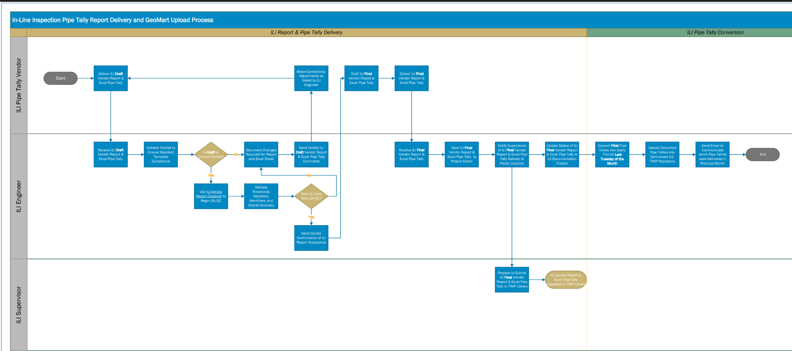

ILI stores their final Pipe Tallies and Vendor reports here: `\\RcShare03-NAS3\TIMP_Library\ILI`

Ideally the process will work like this:

1. Vendor delivers Final Pipe Tally
2. Steven Lee from ILI uploads Final Pipe Tally to `\\RcShare03-NAS3\TIMP_Library\ILI`
3. Steven Lee converts Final Pipe Tally to standard format
4. Steven Lee uploads converted Pipe Tally to `\\RCNAS01-smb\Timp-fs01` (this location can change)

**Remark**: Foundry should then be able to make connection to the `\\RCNAS01-smb\Timp-fs01` location.

__What is the standard format?__

The "standard format" is based on how the data was historically structured in GeoMart. What Satvinder currently doing is ensuring all pipe tallies delivered prior to 08/01 are in that format so he can aggregate the data through Power Query. Steven will help ensure all Pipe Tallies delivered after 08/01 are also in this "standard format". Here is an [example](https://pge-my.sharepoint.com/:x:/g/personal/sfsy_pge_com1/Eaw9ESXjoYRNpuJO0lB-DVEBKz674ARHYooeL4f515cqbQ?e=bd7QdL):

The first tab is how the Tally is delivered from the vendor and the second tab is the standard/converted format

## ILI failure pressure data from MarinerDB

Copying from chat with Jackson for easy reference:

So regarding the actual data (suppose I'm looking into `tstitinfdbsws010` or `tstitinfdbsws009`, MarinerDB_2022), how do I get:

- ILI failure pressure -- which table do you recommend I use? `POE_TRADILI_MATCHED_2022` or some other table? If the former, I'd have to map the flaw location to the pipeline segments that the LOF alg operates on.
  - Answer: Yes use `POE_TRADILI_MATCHED_22`
- Model results calculated using the LOF-Algorithm (not POE) for the pipe segments with available ILI data -- do I get them from failure_pressure table or something else?
  - Answer: Use `EC_RISK_LOF` table to get the non-POE EC risk lofs. "Turns out I don't have the non-POE EC LOFs in the `RiskResults_int2022` table after all" (Jackson)
- How do I map the rows in `POE_TRADILI_MATCHED_2022` table to the different dynamic pipeline segments? The failure pressure table has columns like `route`, `beginstationnum`, `endstationnum`, `beginstationseriesid` for presumably the different dynamic pipeline segments.
  - Answer: "you want to check if `SeriesID` = `beginstationseriesid` and `stationing` between `beginstationnum` and `endstationnum`. I typically do a `>=` for begin and strict `<` for end, that way you don't get any defects mapped onto two segments".
- How does the ILI data already know the dynamic segments?
  - Answer: "I have a GIS script that stations them based on latitude and longitude. It's not always exact though. The tallies have route name though, so I match on that and distance to pipe [...] it's called 'stationing' pipes, though Uriel Garcia is probably better at it then I am" (Jackson)

# 8/29/2023

## Meeting with Kiana

__PowerBI__
- Kiana keeps track of all the different data sources, columns, and calculations that go into each metric.
- Kiana to share sharepoint doc with me.
- Next week: Kiana give estimate of PowerBI deadline.

# 8/30/2023

## Trying to finalize details of ILI data-set details

Satvinder uploaded all the clean ILI tally dataset onto `file://rcnas01-smb/Timp-fs01/2023%20ILI%20Pipe%20Tally%20Consolidation/`. But I can't access it, again!

Jackson mentioned to use the [TSC chat](https://iis10t2prd.cloud.pge.com/MyITServices/tsc/chat) to find out the right AD group to request access.


# 9/5/2023

## Meeting with Ian

Brought up additional data need for Corrosion Engineering Team (driven by Enterprise risk). Essentially, Corrosion Engineering team wants an additional post-ILI procedure to flag pipelines for prevention and mitigatio measures according to additional critieria:
- Any time corrosion deeper than 50% of wall thickness is found on ILI run
- Whenever majority of corrosion occurs on one section of pipe. This has been defined as volumetric wall loss 2 standard deviations above the mean.
- When either of the above conditions are true, the CE team will gather the relevant cathodic protection data and set a meeting with Corrosion Engineering Superivsor and Corrosion Field Services Supervisor or their representatives.

The challenge lies in how to define "section of pipe" and subsequently the sample population.
- Will have to look at the results for different definitions of "section of pipe" and how that changes things.

# 9/6/2023

## ILI problem

Doing performance measurement using ILI failure pressure data against EC LOF model outputs. For ILI failure pressure, I was looking at the `POE_TRADILI_MATCHED_2022`​ table in the `MarinerDB_2022` database, which was compiled from the historical ILI data sets in Geomart (past ILI tally were inserted into Geomart, then an extract pulled from there). Turns out there are ~234 cases where the failure pressure is less than 5 psi, 204 of which are negative.

We can't have negative failure pressures. The table in MarinerDB is obtained through the process:

```
ILI_tally -> Geomart -> OracleDB -> MarinerDB
```

Satvinder has confirmed during his consolidation process that errors exist in Geomart AND the original tally files, which look like have propagated to the marinerDB. Luckily the failure pressure data in that marinerDB table doesn't actually enter the risk model calculations.

I'm going to get help from Jackson and Gordon to apply the GIS stationing process to Satvinder's consolidated ILI data set to proceed with model evaluation work.

## Satvinder giving examples about the anomalies

> The <5 PSI is likely due to Failure Pressure being in Pf/MAOP ratio column and vice versa. The data was imported into GeoMart as-is, which caused the MarinerDB to be incorrect.

> I found multiple Pipe Tallies (usually 2017 or older) with similar and other discrepancies. I’ve categorized my findings below: 

| Data Discrepancies | Occurrence |
| ---------- | ------ |
|Failure Pressure (Pf) and Pf/MAOP data are switched | Low |
|D/S Reference & Dist. To D/S Ref [ft] data switched | Medium |
|Some files have both Tool Speed (mph) MFL-A and Tool Speed (mph) MFL-C, others only have Tool Speed (mph) MFL-A | Low |
|Some files have both Tool Speed (mph) MFL-A and Tool Speed (mph) XT, others only have Tool Speed (mph) MFL-A | Low |
| Some files have both Tool Speed (mph) MFL-A and Tool Speed (mph) MFL-C and Tool Speed (mph) XT, others only have Tool Speed (mph) MFL-A | Low |
| “UNKN” and “SMLS” values in Seam Pos. column — should only be orientation | High |
| “UNKN” and “SMLS” values in O’Clock column — should only be orientation | High |
| “NA” in O’Clock column — should be blank | High |
| Latitude/Longitude contain degrees symbol after value | Low |
| “—" in Dist. To U/S Ref [ft] and Dist. To D/S Ref [ft] | Medium |
| “.” after Station Number value | Medium |
| “TBD” in WT(in) column | Low |
| Rosen Pipe Tally format inconsistent with Pipetel/Intero V4 format | High | 

Many of these discrepancies exist only in legacy Tallies, and I know over the years, the ILI Team has standardized the Pipe Tally template and implemented a QC process.

# 9/7/2023

## EC LOF learnings

Connecting to the MarinerDB's table `EC_Risk_LOF`, I can now see the different EC risk model outputs. Some useful things to note:

- `EC_LOF_Leak_EX`: Value for if pipe is exposed above ground (calculated according to attachment 3, taking into account atmospheric corrosion)
- `EC_LOF_Leak_No_EX`: Value for if pipe is not exposed
- `EC_LOF_Leak`: Final value, taking the appropriate one according to if pipe is actually exposed.

As attachment 3 describes, for EC, there are both rupture and leak LOF associated with it. When plotting them out, we see the following distributions:

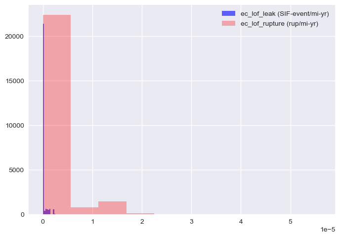
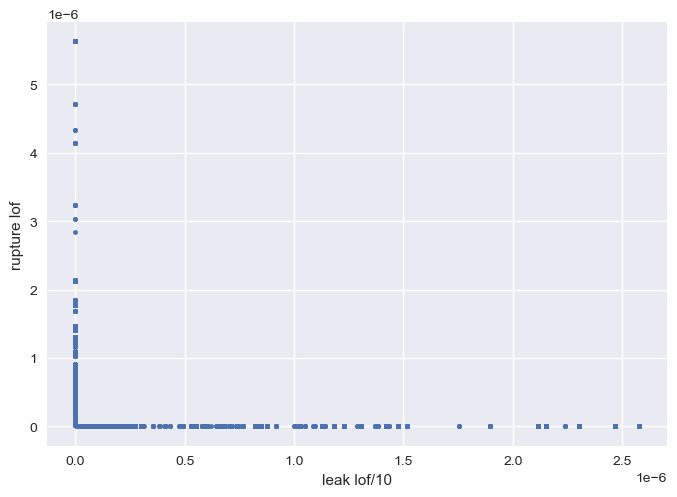

It's clear that the rupture LOF is much higher than that of the leak LOF. This is because they use different units!

- Leak LOF has units of severe events per mile-year
  - Number of leaks that involve a SIF on the transmission side is super low, so we end up multiplyin the adjustment factor by something about 2 orders of mag lower (see attachment 3, Table 2 baseline level)
- Rupture LOF has units of ruptures per mile-year

But why the leak and rupture LOF curve shows essentially two vertical lines? I initially expected that a pipe in bad shape would have both higher chance of leak AND rupture...Brian Patrick explains:

> Each `S` score for a threat turns into adjustment factor, then gets multiplied by the baseline rate to get to an LOF, and each segment will EITHER be leak or rupture, for a particular threat.

> We do not have any logic for mixed failure modes as of yet..prob should be a probability distribution.

So essentially, the model assumes failure either by rupture or leak, hence the weird looking graph. Is it reasonable? maybe..

> In general when we roll up the results, all of the leak segments drop off, since they more or less round to zero.

Does this mean leaks will always stay there, until data show the rupture LOF for that segment becomes high?

> The model right now [...prioritizes on] whether it's possible for the pipe to blow up, based on the biggest defect we have removed, with some more conservatism built on top. We essentially assume the pipe is 70% weaker than normal, then determine whether that would rupture.

So sounds like rupture LOF would always get bigger faster than leak LOF...is there any value for calculating leak LOF then?

> We have to do it per code.

> In terms of asset health, AF would be more of an indicator...Pf/MAOP is how close it is to failing, and does not take the failure mode into account.

__Important__: Benchmark model outputs and ILI failure pressure against Pf/MAOP and AF!!!

> Getting Pf/MAOP value <1.0 is not super uncommon, happens a few times a year..most of the times it is due to over-conservative assumptions.

And this was found out after the pipe was dug-up and inspected.

## ArcGIS stationing and spatial join

How to convert ILI tally excel sheet so the info is compatible with the dynamic pipe segments in MarinerDB? Two methods: "stationing" or "spatial join".

- Stationing: Given ILI coordinates, query the pipeline data (from GTGIS) and match pipe centerline, then get stationing number. Then match these info against the MarinerDB pipe segments.
- SpatialJoin: Given ILI coordinates and specific pipe segments (import both into ArcGIS), and the pipeline data (from GTGIS), do "spatial join" operation to output the results.

GTGIS pipeline spatial information has snapshots every year -- use correct year's snapshot! Stationing process is supposedly more precise than spatial-join (assuming coordinates are correct).

During ArcMap/ArcGISPro operation, use `WGIS84` format for coordinates.

## TIMP has remote desktops!

For use as devservers:

```
WSSR489887.utility.pge.com                   
WSSR507841.utility.pge.com                  
WSSR647920.utility.pge.com
WSSR647918.utility.pge.com
WSSR640770.utility.pge.com
WSSR640771.utility.pge.com
WSSR551388.utility.pge.com
WSSR529284.utility.pge.com
```

# 9/22/2023

I know how to do spatial-join now, now I need to get the data to conduct this.

Data sources:
- Pipeline data: From GTGIS...where to get these?
- ILI Coordinates: This is from Satvinder's big excel sheet.

Question I need to figure out:
1. How to create a "geo-database" -- do I import from the GTGIS file? From Gordon:
  - Current year's pipeline data (GTGIS snapshot) is in `V_PFL_ALL layer`, in the ArcGIS [database]( \\rcnas01-smb\sysintegrity-fs01\SysIntegrity\RiskMgmt\SI\SME_Tables_RiskAnalysis\QRAD_2023\DataQuality\V_PFL_ALL.gdb\V_PFL_ALL_spatialonly081023).
  - For previous years, they are in the `Pipesegment` spatial layers in each year's `validationdata.gdb` -- can ask for historical archives from the GTGIS team.
  - GTGIS has the current data in 2 layers in Oracle SDE (ESRI spatial database engine): "Linear_Features" and "Point_Features", will need permission to access the oracle data.
  - For 2022, for example, all the pipe segments data exported from GTGIS can be found in [this database](\\rcnas01-smb\sysintegrity-fs01\SysIntegrity\RiskMgmt\SI\SME_Tables_RiskAnalysis\QRAD_2022\Validation\ValidationData.gdb\Pipesegment_linear)
2. For ILI Coordinates...I start with 2022's inspected segments?

Specifics of doing spatial join:
1. Inspect data -- look at ArcMap's map display -- laod both ILI points and pipesegment layer.
  - To turn ILI x/y data into points, you'll specify lat/long coordinates and use "Georgraphic coordinate system -> World -> WGS84".
  - When running spatial join any coordinate conversions are handled automatically by the spatial join tool, need to turn the ILI data into points first.
2. ArcMap has a data scaling problem, Gordon suggests:
  - Use thte ArcGIS Model builder "iterate" tool to build a loop (or use Python), then subdivide the ILI data into probably 10-50k record chunks for processing, then merge the results together.
  - Use Arcpy to run spatial join in the python script.

# 9/26/2023

ILI data problems...loading in ILI data in Python (which actually works, and excel freezes).

For 2022's data:
1) some data rows do not have Longitude/Latitude data.
2) some data rows do not have "U/S Reference", "Dist to US Ref", combinations,
3) Not all data rows contains a "PG&E Station Number"

Satvinder indicates this is done to vendor error...but why these data don't have coordinates?

This makes matching it to GTGIS Pipeline data difficult...why? From Gordon:

> If there is stationing populated already for the anomaly we may be able to reference that year's centerline to get it spatialized. Without stationing or coordinates, the ILI run data will need to be aligned with centerline - this is usually a significant project for a GIS specialist to do and requires ground survey data that came with the ILI project. This work has not been done by us for several years because of software tool problems and lack of bandwidth, and also because ILI vendors do this work these days and give us coordinates.

So what can we do? Ignore the anomalies without the coordinates...which is possible since it consists of only 0.26% of the available ILI data that year.

Gordon also note the data seems to belong to NT runs (ILI runs with tethered tools that are not pushed by gas pressure, usually work in short pipe sections for difficult to reach areas) by looking at the "ILI Project name description".

> My understanding is that for NT ILI runs the vendors do not do the spatial alignment work so we haven't been able to use their data at all for the risk run. NT projects are usually short but still we need a process to match the anomalies to location. The second screenshot has a few stationing values populated which is usable if we find that year's centerline (the year when they started the project). The US/DS distance are basically odometer readings I believe; this is used in the ILI spatial alignment process to pinpoint the anomaly, but cannot be used otherwise.

And indeed, all the anomalies without coordinates belong to short NT runs! For 2022, these runs are 0.28 and 0.1 miles long. So we can ignore them for now.

Additionally, Gordon mentions ILI datasets with significant missing lat/long are excluded from risk runs.

__But this also begs the question -- what's the point of doing NT runs if we are not using the data? Do they lead to direct examination?__

# 9/27/2023

More problems with the data sets.

See [notebook](https://github.com/allenyin-pge/ModelPerformance/blob/master/EC_LOF_and_cleaned_ILI.ipynb) for examination results. Current procedures used to get ILI anomalies matched with MarinerDB EC_LOF table results:

1. Take Satvinder's All_ILIData.csv, extract the rows for ILI that was completed in 2022 --> call this `clean_ILI_2022.csv`
2. In ArcMap, opened the `Pipesegment_linear` layer from the [`ValidationData.gdb`](\\rcnas01-smb\sysintegrity-fs01\SysIntegrity\RiskMgmt\SI\SME_Tables_RiskAnalysis\QRAD_2022\Validation\).
    1. Copy the entire folder `...\Validation` over to local first so we can add/change things without screwing over everyone else.
    2. Name it something useful, say `...\ModelValidation2022`.
    3. In the catalog pane of ArcMap, add that folder under `Folder Connections`.
3. Imported `clean_ILI_2022.csv` into ArcMap:
    1. Ex: create a folder `...\ModelValidation2022\ILI_data`, then copy the csv file there.
    2. Now drag that csv file into the Layers Pane.
    3. To "Display as X/Y Data", choose `longitude` as `X`, `latitude` as `Y`. Then click `Edit` and pick `Geographic coordinate system -> World -> WGS84`. This will plot the anomaly as events with (X, Y) coordinates from pairs of longitude, latitude data. The layer overlay looks to be ok.
        - Note that WGS1984 is a coord system used by generic GPS units and works world-wide.
        - The coordinate system used within PGE is `GCS_North_American_1983`. This coordinate system and WGS1984 are compatible within Continental USA but not in rest of the world.
        - For example, `Pipesemgent_linear` layer is in the NA1983 coordinate system.
    4. We can export these events as its own shape file by right clicking the layer: `Data -> Export Data`, then choose the `Data frame` coordinate system -- this way it'll be saved in `GCS_North_American_1983` coordinates system and be compatible with everything else.
4. Spatial joined `Pipesegment_linear` layer to `clean_ILI_2022` layer, with "each point be given all attributes of the line closest to it"
5. The joined layer is exported as `cleaned_ILI_2022_joins_Pipesegment_linear.csv` It now has attributes "route", "beginstationseriesid", "endstationseriesid", "beginstationum", "endstationnum".

The spatially joined outputs look ok.

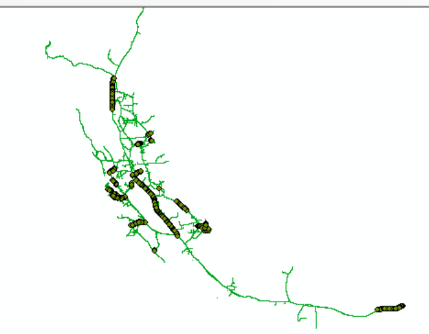.

Now I try to match the data in `cleaned_ILI_2022_joins_Pipesegment_linear.csv` with the pipelines present in MarinerDB 2022's `EC_Risk_LOF` table.
- The server I connected to is "tsitinfdbsws010", db name="MarinerDB_2022"
- I selected only the rows in the EC_Risk_LOF table, where ILI_Completion_Date is in 2022.

## Issue 1: ILI route mismatch

The set of "route" values in `EC_Risk_LOF` table are not the same as those derived from the ILI+Pipeline spatial join.

Screenshot below is when I try to match the routes present in the EC_LOF table with the routes from the ILI tally:

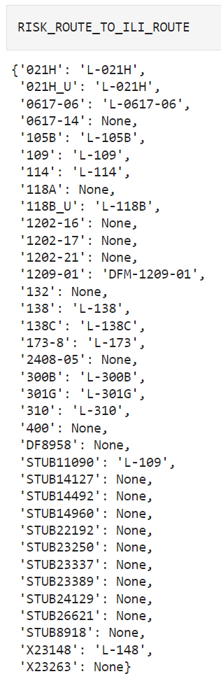

The next one shows the unique route numbers present in each data set:

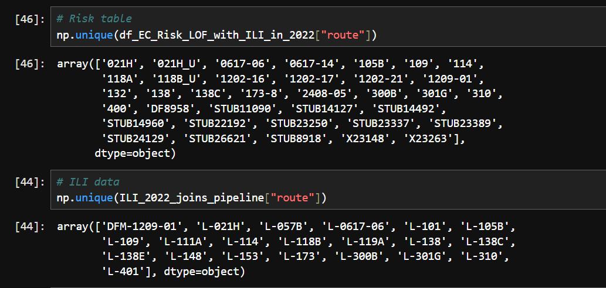

Gordon mentions all the routes of the format "STUB*", "B**", "DF*", and "X*" can be ignored. But this still leaves routes like "400", "1202*", "118A", "132", etc with no matches.

- We have determined that the `ILI_Completion_Date` field in the `EC_Risk_LOF` table comes from the `Assessment_history` table, which comes from Bill Boynton's assessment history reports.
- These dates supposedly represent the dates when an ILI route project is COMPLETED.
- Therefore, it should match that of the "survey date" field in the ILI tally sheet, as compiled by ILI team and Satvinder.
- But the set of unique routes present in the `EC_Risk_LOF` table and the ILI tally, for the SAME year don't match, this would mean problems in:
  - Data entry from assessment history into the MarinerDB and/or processing within, or
  - Mismatch between the reporting in assessment history vs. ILI tally collection
- Gordon confirms that the Bill Boynton's team operates independently from ILI tally, so will need to check the actual assessment reports for possibility of Option (2).

But this issue may be side-stepped, if I only look at the sub-set of routes that match.

## Issue 2: Pipeline segmentation mismatch

I tried to match the ILI anomalies to the correct pipeline segment by matching the following between the `EC_Risk_LOF` table and the imported joined ILI tally data:

1. Same `route`
2. Same `beginstationserisid`
3. `beginstationnum` and `endstationnum` range matching

And then for the entire datasets, I get only 18 pipeline segments that have any anomaly entries mapped to it..

Gordon mentions it's because the `EC_Risk_LOF` segments are more finely grained than the GTGIS pipeline segments, hence the mismatch. He suggests I import the `EC_Risk_LOF` data into ArcMap, spatialize it by "right click on table" -> "display route events", then finally export the spatialized data layer into a feature class.

I can do this because `EC_Risk_LOF` segments are sub-segments of the pipeline segments...


## Next week todos...

1. Check the results from spatializing EC_Risk_LOF as route events, and spatial joined to the ILI layer from before.
2. Check assessment history and ILI tally in terms of routes, and ILI completion date.


# 10/4/2023

## Spatial-join-goodness

The spatial join crashed...have to redo it again. But just as a reminder of the procedures taken to join `EC_Risk_LOF` segments with the pipeline segments.

1. Connect to marinerDB within ArcMap.

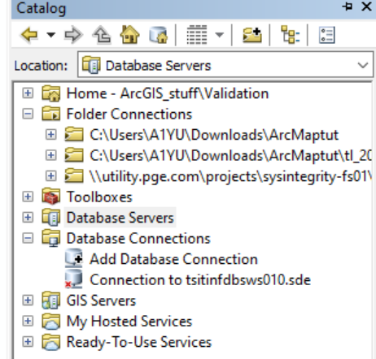

2. Copy the `EC_Risk_LOF` table over into my local copy of `Validation.gdb`, this can take a while.

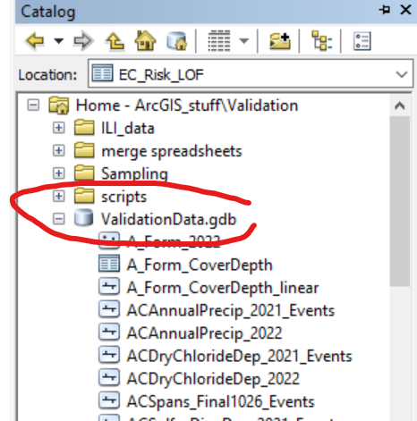

3. Load the table into ArcMap by dragging it to "Table of Contents"

4. Load the previously spatial-joined `cleaned_ILI_joins_pipelineSegments` shape file into "Table of Contents" as well.

5. Spatialize `EC_Risk_LOF` by "right click on table" -> "display route events", following config similar to below (change the table name). 

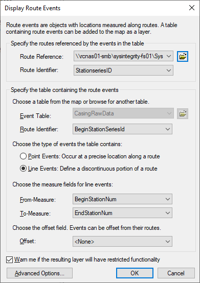

The end result shoud look something like this:


The teal lines are the spatialized `EC_Risk_LOF` as route events, and the points are `cleaned_ILI_joins_pipelineSegments` layer.

6. Then we can export the spatialized data layer (the lines) into a feature class.

7. Then do spatial join between the two layers to get a table! Gordon mentioned to not display the existing layer to save rendering time.

## Dataset migration and documentation

There's a need to document how the different data sets that feed into the Risk Model get ingested, cleaned and handled. Right now this is localized to Steven Liu and Gordon Ye. Would be great to document these processes and edge cases, etc, like how Satvinder did with the ILI data set, so as to make Foundry migration easy and scalable, democratize the knowledge.

## Corrosion wall loss statistics

Ian wants to get started on the corrosion-engineering team's ask from 9/5.

I'll do some prelim analysis on anomaly-level wall-loss from historical ILI data sets.

# 10/5/2023

Finally got some...not shitty data and results, with the ILI-data-spatial-joins-pipe-segments-joined-EC-LOF-table! For conciseness, I'm going to denote spatial join as `SJ()`. So the data table I'm using will be:

`SJ(SJ(ILI, pipe_segments), EC_Risk_LOF)`

Note that the order of operands in `SJ(.)` matters, they are not commutative, and this specific order of operation actually completes without crashing the laptop.

The notebook is [here](https://github.com/allenyin-pge/ModelPerformance/blob/master/EC_LOF_and_cleaned_ILI_spatial_join.ipynb).

I haven't yet figured out how to map multiple anomalies into a single pipeline segment, so right now the plot is values associated with an anomaly vs. the risk calculated for the dynamic pipe segment CLOSEST to it. When I work this step out, we likely the points will decrease.

First ok-looking plots!

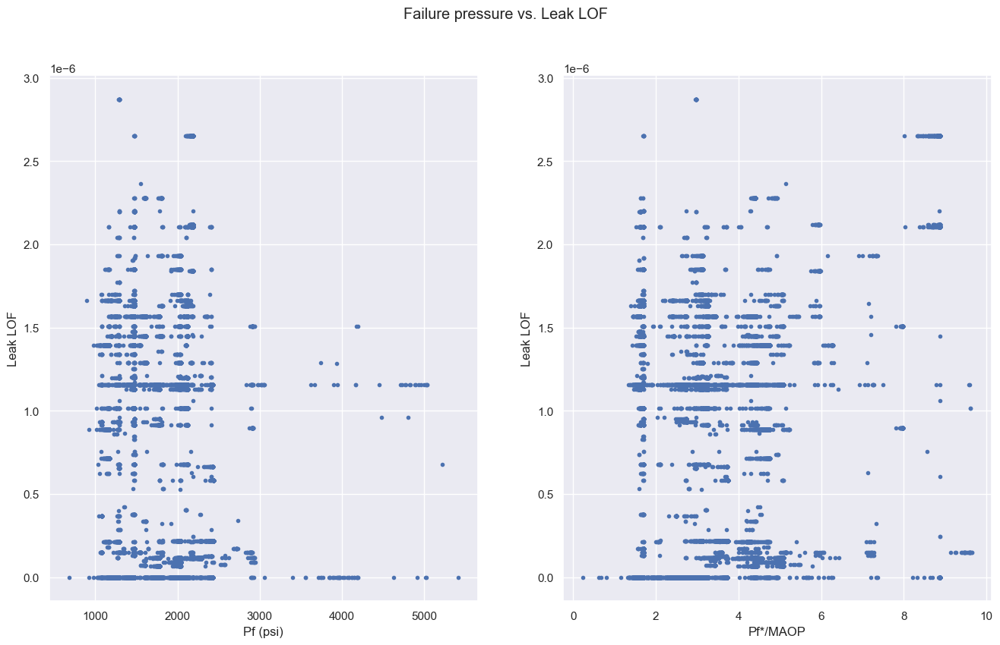

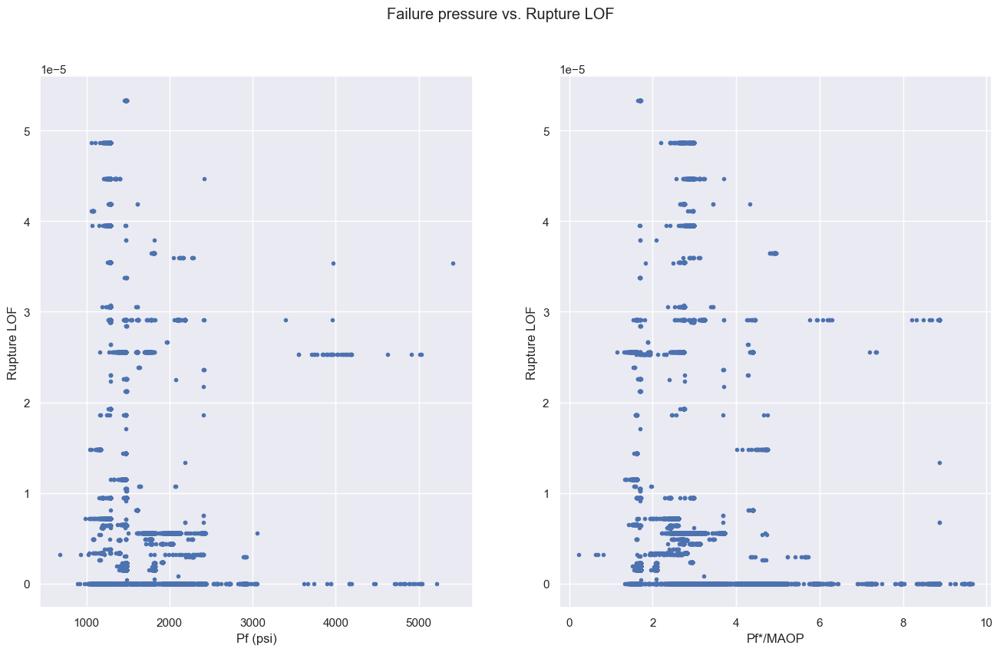

Overall, it doesn't seem very informative...the general trend is that when Pf is low, Risk is high (both Rupture and Leak). When Pf is high, Risk is low. In between, it's all over the place, which indicates a lot of uncertainty in the model calculations..

# 10/10/2023

Worked on Ian's task of looking at wall-loss statistics from the ILI data. The notebook is [here](https://github.com/allenyin-pge/ModelPerformance/blob/master/cleaned_ILI_data_examination.ipynb).

Some notes on cleaning the data:

1. For external corrosion, we want the wall loss, this is recorded as the `Depth (%)` field in the ILI tally.
2. We want to excluse all manufacturing-related wall loss. This can be done by filtering the `Identification` field of the ILI tally.
3. There are many one-off `Identification` field values, such as `ext box xxxx-xxx`.
4. Brian suggests use all rows whose `Identification`'s is not manufacturing related.

Some statistics:
1. After removing all rows whose `Identification` values are null or empty, there is a total of 1702946 rows from the compiled ILI data from 2000-2023.
2. 94.8% of these rows have `Identification` values that occured only once (e.g. `ext box xxxx-xxx`).
3. Approximately 8.188% of these rows are manufacturing related (139436/1702946).
4. Out of the remaining 1563510 non-manufacturing anomalies, 647945 anomalies (41.4%) have `Depth (%)` field, i.e. wall loss measurement available.

Wall-loss statistics:
- Out of all years' available data pooled, the mean anomaly wall loss is 15.638%, 2D=32.846%.
- Over the different years available,
  - Mean wall loss for different years range from 1.77% to 28.75%.
  - 2D wall loss for different years range from 13.03% to 54.0% (mean 2SD=35.37%).
- The overall and yearly 2SD numbers are pretty close, being conservative, we would make __32%__.

# 10/12/2023

Foundry team says maybe some of the datasets we need are already in Foundry -- compile all the datasets we need to for risk modeling and let them check.

Foundry tutorials that the users of the dataset should do: [link](https://damask.palantirfoundry.com/workspace/compass/view/ri.compass.main.folder.6216e7b1-1dfc-4a44-a312-0d78502e1dd7)


# 10/17/2023

## Talking about performance measurements with Ian:

- Does Pf/MAOP or  Pf matter more?
  - Ask Brian about leak-rupture boundary.
- Talk to Gordon about automating all of the spatial join process.
  - But how many years of MarinerDBs do we have still?

## About Corrosion percentage

- What do we want from this analysis?
  - Know what's a good criterion to dig up pipes and look for issues.
  - Want to know areas with a lot of corrosions.
- Try "volumetric" loss over one joint of pipe
  - For anomaly with width/length, calculate volume...
  - How to identify shallow but widespread, vs. deep but localized areas?

## Foundry training

PG&E internal resource for [Foundry training](https://pge-my.sharepoint.com/:b:/g/personal/sfsy_pge_com1/EauD9uyLgrNKjKlXWgXL-q8BUlCmHGRP-tXUiGLO37sVlg?e=bP9MJL)


# 10/24/2023

Compiling all the Foundary Ontology meeting notes, mostly from Jayna (lead on the dataset ingestion):

- For ILI data, see [here](./FoundryOntologyNotes/ILI.docx)
- For Leakmaster dataset, see [here](./FoundryOntologyNotes/Leakmaster.docx)
- For CISRead dataset, see [here](./FoundryOntologyNotes/CISRead.docx)

# 10/31/2023

## Discussion with Ian about volumetric loss for corrosion.

Updated notebook is still [here](https://github.com/allenyin-pge/ModelPerformance/blob/master/cleaned_ILI_data_examination.ipynb).

Observations:
- Not all anomalies with "depth (%)" field available have also width and length.
  - Satvinder later informed me that not all of these rows are EC -- if the location is "internal", then it's an IC anomaly! So need to change that.
- There are anomalies whose width is pretty much the entire circumference of the pipe. Laila from ILI confirms that this is possible. But this is this a very small percentage -- 99% of all anomalies have width less than 1% of the pipe circumference.
- Need to redo the calculations to convert "depth (%)" to inches via the "WT (in)" field to get volumetric loss.
- Plots show that the volumetric loss is heavily skewed to the right (need to take the log of the values to create distribution plot that looks more Gaussian/normal)
  - Note that the x-axis unit is in `in^2 * (% wall loss)`, will have to correct this to `in^3`.

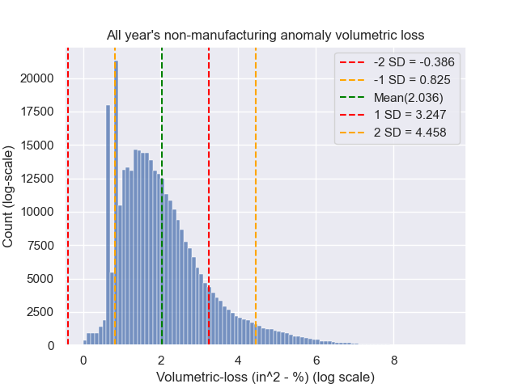

## Aggregating ILI data vs. Risk model outputs

The notebook is still [here](https://github.com/allenyin-pge/ModelPerformance/blob/master/EC_LOF_and_cleaned_ILI_spatial_join.ipynb).

Problem encountered:

1. Look at unique combinations of `(beginstationseriesid, beginstationnum, endstationnum)`, since each pipe segment in the risk table is defined by this triplet.
2. Doing some sanity check -- I assume that the `EC_LOF_Leak` and `EC_LOF_Rupture` values should be constant for all rows with the same combination of those values, if the spatial joins of the EC table and the other data are done correctly.
3. What I saw is that about 21.6% of all such segments available have more than 1 EC_LOF_Leak values available

The procedures I used to get the final {pipeline, ILI, EC_LOF table} joined table were the following:

1. joining `Pipesegment_linear` from `ValidationData.gdb` of 2022 to `cleaned_ILI_2022.csv` (this is cleaned version of 2022's ILI data)
2. spatialize the `EC_Risk_LOF` table by doing "display route events" in ArcMap
3. Spatial join (1) and (2) -- this is the final table I've been using.

Debugging process with Jackson:
- Inspected the `(beginstationseriesid, beginstationnum, endstationnum)` for the table rows that have multiple `EC_LOF_xxx` values, from the 
- Compare the triplet values against those present in the `EC_LOF` table itself.
- Found that in the final table, the `(beginstationnum, endstationnum)` segments are longer than the individual segments in the `EC_LOF` table.
  - Essentially, the pipeline segments in my result table merged multiple `EC_LOF` table segments, resulting in multiple risk values for pipe segments.


Potential solution:
1. We suspect it's because the `Pipesegment_linear` segments are labeled differently from the dynamic segments in the risk table.
2. So the proper procedure would be...join `EC_LOF` to `Pipesegment_linear`.
3. Then spatialize the ILI data onto (2).

Not sure if makes sense, but can check if correct by comparing against the pipe segments in the original mariner `EC_LOF` tables.

# 11/13/2023

Updates on multiple things.

## Volumetric loss 

Corrosion engineering meeting take-aways:
- Corrosion engineering currently DOES use the EC_LOF risk scores for deciding what pipelines to do further inspection.
- The risk model pipe segments are still too large, however, and more finely grained criteria are needed, due to limited resources.
- Additional requests to improve metal-loss based criteria:
  - Use %-loss (width * length * depth_loss_%)
  - Sum over all anomalies found per segment between girth-weld (40 or 80ft)

## Foundry data ingestion updates:

Updated notes on [ILI data](./FoundryOntologyNotes/ILI.docx), [Leakmaster](./FoundryOntologyNotes/Leakmaster.docx), and [CISRead dataset](./FoundryOntologyNotes/CISRead.docx).

### ILI

Going smooth -- ingestion will start soon. There won't be any alterations to the existing ILI data pipeline (from vendors to ILI team). The Foundry integration will ingest each year's csv file and append to the Foundry onotology object.

### LeakMaster

Identified ingestion target as the csv file generated from CSV. See diagram for current vs. (planned) Foundry pipeline.

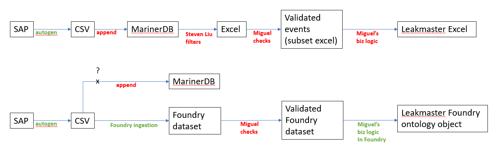

### CISRead

Settled on the consolidated CISRead table (merging DA and Corrosion Engineering datasets), and using GMCloud as the ingestion start point. See diagram for current vs. (planned) Foundry pipeline.

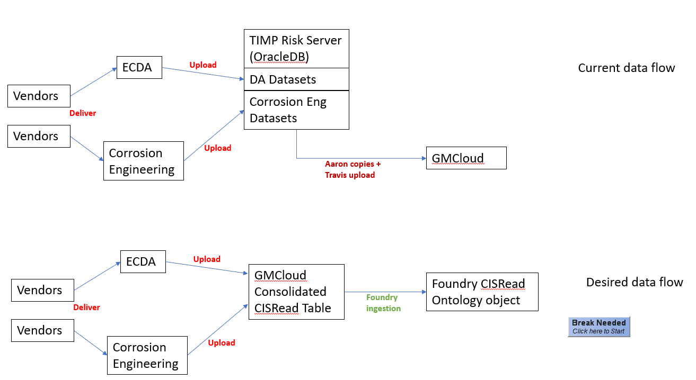

# 11/21/2023

The general flow of Foundry data integration:

1. Identify dataset, business owner (people who wants to use it), SME and data owner (they can be the same).
2. Identify how the dataset is generated, specify the ETL pipeline
  - Identify if any steps in the process is present in Foundry already and can be reused.
  - Identify how upstream to start the ingestion process, based on convenience and stability.
3. Figure out the input data schema (columns, values, primary key, etc)
4. Figure out the transformation steps and final ontology schema.


# 11/29/2023

Leakmaster dataset problems:

1. Logic and data sources for SAP -> CSV file transformation unknown and needs to be tracked down.

__Leakmaster "duplicate" leak numbers__

> It seems like sometimes SAP can emit duplicate leak events (with same leaknumber as a previous one), due to SAP workings. Here I define “event” as data associated with a specific leak report.

> Note that this is not the same as a leak being reported at the same location twice — in that situation two events with different leaknumber will be stored in SAP.

>The confusion is on how to deal with ingesting events whose leaknumber already exists in the foundry dataset.

> Currently Miguel would manually check the new event with the duplicate leaknumber and decide whether it’s safe to ignore — if yes, it gets ignored. Otherwise, it gets either replaced or added to some logic.

> The caveat here is we probably don’t just want to do row replacement whenever an event with the same leaknumber occurs, because we don’t understand what might be causing this duplication in SAP.

> So I think there are a few ways to approach this:
> 1) figure out why duplicate leaknumber might happen in SAP and write logic to deal with them appropriately
> 2) In the periodic SAP data ingestion process, add a step such that any duplicate between the newly ingested data and the final QC’d leakmaster dataset are flagged for manual review.

__Leakmaster dataset QC involves other data sets__

The SAP data associated with the leak events are cross checked with other data sources, for example gtgis in arcmap is used to convert the lat/long in the reported leak event to actual pipeline locations, pipeline pfl to verify pipe characteristics (coating, thickness, etc).

Depending on these cross references, the data that enters into the final qc’d leakmaster dataset may be updated from the original SAP values.

So the bottom line is, the logic to merge SAP leak data into the final qc’d leakmaster dataset contains steps that involves a bunch of other datasets, that may or may not be currently present in Foundry right now.

Miguel and I will try to compile a list of these steps and the different datasets needed for our meeting next week. Even if it’s not complete, I realize this might change the work plan quite a bit as maybe new datasets might need to be ingested and it’s unclear whether that will be out of scope for this project.

__Note on SAP data__

Leakmaster data comes from SAP post-2014.

# Week of 12/4

## Leakmaster ingestion:

Need to find out how the monthly export from SAP is generated from SAP, the 
Foundry ingestion process should start from as upstream as possible.
  - Emailed **Brady Goodwin**, as he sends the monthly export to Steven.

Additional knowledge about Leakmaster data set...
1. Monthly review process started in 2014, not sure how data enters into the dataset prior to that.
2. Leakmaster dataset has rows that might not have SAP leak number, such as in 2014, and from processes other than Miguel's monthly leak review process.
3. Other people/processes can edit/enter data into the Leakmaster dataset, e.g. Thien-An, need to eventually understand those processes.

Therefore, we are now dividing the Leakmaster data into two types:
1. SAP-derived leaks: This go throug the monthly review process, which we understand well, thanks to Miguel.
2. Non-SAP derived leaks: Lots of processes with this one, punt to take care of later.

Till EOY2023, Leakmaster Foundry ingestion will have two steps:
1. Ingest the Leakmaster dataset and update it monthly with the newly added entries as is.
2. Establish the SAP-derived leaks process, incorporating the monthly review process.
  - In the event of entries with duplicate SAP leaknumbers, the process calls for them to be ignored.
  - Use the "master index" as the primary key.

## ILI ingestion

Even the Satvinder processed ILI tally can have duplicate rows, and other problems. But Foundry will first ingest them as is (raw), then apply data cleaning and transformation to yield a cleaned version.

## Xodus modeling

Gordon informed me that the company Xodus wants to help us build risk models for free, but they obviously need data, etc.

This will require us sharing the relevant data sets (raw or the processed data from the risk model runs?)
- Also need to have NDA and data sharing plans in place. Need to ask Steven Hui and contact legal (Andrew Tran) about it.

## More todos:

1. Continue model performance work...up to 2019
2. ~~Look at Miguel's data process and find the data sources needed.~~
3. ~~Follow-up with Steven Hui and Andrew Tran about Xodus plans~~
4. Figure out with Steven Liu the data sources and processes -- I might not have time to do this..

## Clarion Probabilistic Modeling Course

Course materials [here](assets\clarion_probabilistic-failure-models-for-pipeline-risk-assessment-december-2023-pdf_2023-12-08_1621.zip)

### Takeways:

The typical approach is:

1. Decide limit state equation (informed by mechanism of failure)
2. Estimate probability distribution of limit state equation factors (through measurement, experiments, etc)
3. Monte Carlos simulations based on the limit state equation, and sampling from the component distributions to get probability of failure.

Validation seems like a problem and doesn't seem like there's an established way to check that the model is correct. For sparse historical events, it's still an open problem. The main rationale is that, if the factors into the limit state equation are reasonable, the limit state equation (parametric) is correct, and the simulation process is correct, then likely our model is correct.

Why not the ML/Statistically driven approach?
- Instructors suggest that they can work when there's enough data available.
- Otherwise, parametric/limit state equation based approach work.

How to deal with counterfactuals? (i.e. if our model works correctly, then failure is prevented, which would in turn make our model seems like an overestimate of risk)
- No easy way
- If annual dig results are showing decrease in risks, assume it's working..but that means there's always a baseline level of digs/inspections that need to be done.

So how does this inform our work?
- ML approach MIGHT work
- Model performance measurement VERY important to even know what to do!

# Week of 12/11/2023

Updated all Foundry data set before/after processes [here](https://pge-my.sharepoint.com/:p:/p/a1yu/EQrwiB3S9x9HkD3lsxxrZtAB-G2Sjc6MEnyeDlPgkQetWg?e=UGPB6m).

TODO:
1. ~~Time sheets~~
2. ~~MOC training~~
3. ~~Update Foundry work notes~~
4. Write Retro for Foundry process
    - ~~Make updated before/after Foundry flow process: 12/22/2023~~
5. Make numerical examples for corrosion engineering

## ILI ingestion

Confirm column data types! Ontology pipelines [here](https://damask.palantirfoundry.com/workspace/data-integration/monocle/graph/ri.monocle.main.quick-graph.06da5ebc-842d-4f25-9bc7-b5de91cee2df).

Done!

## Xodus

Looks like we'll have to go through sourcing, legal, etc., before being able to get the whole thing started. Starting before end of year seems unlikely.

### Kickoff meeting notes

Jill has background in nuclear engineering probabilistic modeling -- pipeline for water cooling. Also a lot of risk analytics in other pielines.

__Proposed work__

Background: Have done a previous pipeline PRM, but don't have direct engagement with client.

Want to start with a certain segment, demonstrate PRM value and figure out time it takes. Want to collaborate to figure out:
  - What pipelines to do, how many miles?
  - What concerns do you have?
  - My related question: What kind of data would you need, how do you validate it?

Brian's question: Past problems with not having enough data to calibrate/validate the risk model, not enough data to figure out the component probability distributions.
  - Jill: Does data model represent the systems? No numbers...use generic probability distributions. Want to bring more people to go through models and try to understand the validity.
  - Follow-up question: How to validate the model is correct? Do uncertainty analysis and check how they change the model outputs. Check how much confidence models assign to historical accidents.

Data challenges: For unpiggable lines, use attachment-3 models based on SME and mechanistic understanding.
  - Jill mentions the challenge of extrapolating known pipeline data to unknown pipeline data. Suggests as the model matures, this capability increases.
  - Relatedly, Bronson suggests pick two routes that are "similar" in risk profile. One has good ILI data, the other doesn't.
      - Jill also mentions needing human operations data, weather, etc. But we might not have those data available..

Jill wants to have the raw ILI data to use the uncertainty to feed into the PRA models (use event-tree?).

__How does the project need to go?__

1. Share our attachment3 models and mechanism understanding, figure out event tree.
2. Do a data audit on whatever is needed, what we have available, and figure out what data gaps need to be filled.


__Timeline__

1. Get NDA in place -- need line of business to ok it (Bronson, Chris, etc)
2. Share procedures
3. Do a data audit. 
4. Prioritization of data sources and do scope reduction..?
5. Want regular communications of their work..

__Data sharing__

- Need NDA to share procedures which contains the model mechanics, calculations, and procedures.
- Data sources that feed into our risk model
- Operation procedures, historical changes, etc.
  - Brian says use MAOP assumption
- Use "CAFTA" for model calculation and data-ingestion (used by nuclear and wildfire).

## LeakMasterUpdateDec2023

I went through Miguel's [process document](./FoundryOntologyNotes/Monthly&#32;Leak&#32;Process.pdf), and some of Steven's [doc](./FoundryOntologyNotes\FD&#32;CR&#32;108149642&#32;Leak&#32;Data&#32;Report&#32;Program&#32;for&#32;TIMP&#32;Annual&#32;Risk&#32;Analysis_V1.2.docx) and compiled the following [notes](./FoundryOntologyNotes\leakmaster_monthly_review_process_notes.docx)

The main takeways are the following:

1. In addition to the SAP pull of the leak data generated by the monthly reporting process, Miguel does cross-check of the pull data with additional SAP database information, namely:
    - IW22
    - Gas Corrective reports
2. There are some overlap between these additional sources and the data used to generate SAP monthly pull, for example, the monthly pull process uses information from tables that are associated with "Gas Corrective". It's not clear what the overlaps or differences are in here.
3. The monthly review process also incorporate manual communication with the repair technicians -- this is NOT in any of the database but is ad-hoc.

So, this process seems even more complicated than we have planned. But here is my proposal to the group:
1. Foundry can't really do much about manual communications (step 3 from above)
2. We need to know more about how the different IW22 and Gas Corrective reports look up from SAP is generated -- what fields they come from in SAP, etc.
3. We might need to re-think the leakmaster ingestion process because some of the cross-validation logic seems like judgement call due to ambiguities that need to resolved through ad-hoc communications. So I propose the following three phase approach:
    -  Phase 1: Keep the planned ingestion process of: [SAP --> SAP monthly report --> apply Steven's logic to keep only transmission events]. And also the ingestion of the current Leakmaster dataset spreadsheet.
    - Phase 2: Figure out IW22 and Gas Corrective SAP generation process -- does it make sense to replicate this processs in Foundry or directly import it into Foundry?
      - Group the outcomes of this and the pipeline in Phase 1 together for easy data navigation within Foundry, this then leads to the next Phase
    - Phase 3: Have form/UI in Foundry that Miguel can use to inspect all the information from the previous two phases, and enter information corresponding to each leak in the monthly review process. Upon completion, this can be committed into the final leakmaster table

Phase 1 we are close to finish/already have a line of sight to goal, I think.

Phase 2 seems like it has additional complexities that won't seem practical to finish this year.

Phase 3 probably requires more scoping work.
 
This way we can have deliverables for this quarter's hardwork and have more time for the extra work. The leakmaster process is complicated and right now it doesn't seem like automating the entire process is realistic.
 
### Update

- Phase 1: Just ingest the Leakmaster dataset and update every month. Miguel's workflow doesn't change.
- Phase 2: All SAP-related work will be here, including the SAP--> monthly leak repair csv file process.
- Phase 3: Everything else, connecting the monthly review logic to the final Leakmaster dataset.

## CISRead

Pretty much done. There are columns that require data cleaning, however, and it was decided that they should be updated upstream in the geo-data bases (prior to GMCloud).

See updated pipeline understading figure:


## Steering Committee Meeting planning

1. Need to show performance measurements for EC.
2. How to show risk assessment for SCC is working?
    - Problem: SCC events are sparse, make it hard for model validation.
    - Possible approaches:
        - Verify SCC frequency increase with time (assumption checking)
        - Check other assumptions in the SCC threat flow-chart.
        - Run known SCC events through the flow-chart, and see if there are more event counts in strong than moderate, than no threat to identify flow-chart consistency.


# Week of 12/19/2023

## Work on Performance Metrics

Here are the correct steps to get the spatial-join to work such that the ILI anomaly events are mapped to the same dynamic segments as the EC_LOF table.

0. Import the `EC_Risk_LOF` Table to `Validation.gdb` (follow step 1-3 in 10/4/2023 notes, section Spatial-join-goodness, step 1-3).
1. Drag `EC_Risk_LOF` and `Pipesegment_linear` table to ArcMap's `Table of Contents` pane.
2. Spatialize `EC_Risk_LOF` onto `Pipesegment_linear`("right click on table" -> "display route events"), results in `EC_Risk_LOF_Events`. See screenshot below:
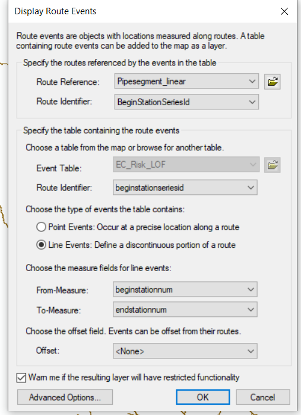
3. Save this as shape file, and export it as a feature class into `Validation.gdb`.
4. Create spatial index for this new feature class, following [this](https://support.esri.com/en-us/knowledge-base/how-to-build-a-spatial-index-for-a-shapefile-000006147). It's important to create spatial index for everything we spatial-join together, otherwise it'll take forever (more than 30 hours!!)
5. Export the `CleanedILI_2022` shapefile (created from 9/27/2023 steps 1-3) as a feature class into `Validation.gdb`, create spatial index for it.
6. Drag the feature class into the content pane.
7. Spatial-Join `EC_Risk_LOF_Events` to `cleaned_ILI_2022`. In GIS lingo:
    - Target=`cleaned_ILI_2022`, which are point features
    - Join feature=`EC_Risk_LOF_Events`, which are line features.
8. After this, the result is `SJ_target=ILI_join=EC_spatialized_to_Pipesegment.shp` (don't need to save in `ValidationData.gdb`) and is displayed in the screenshot below:
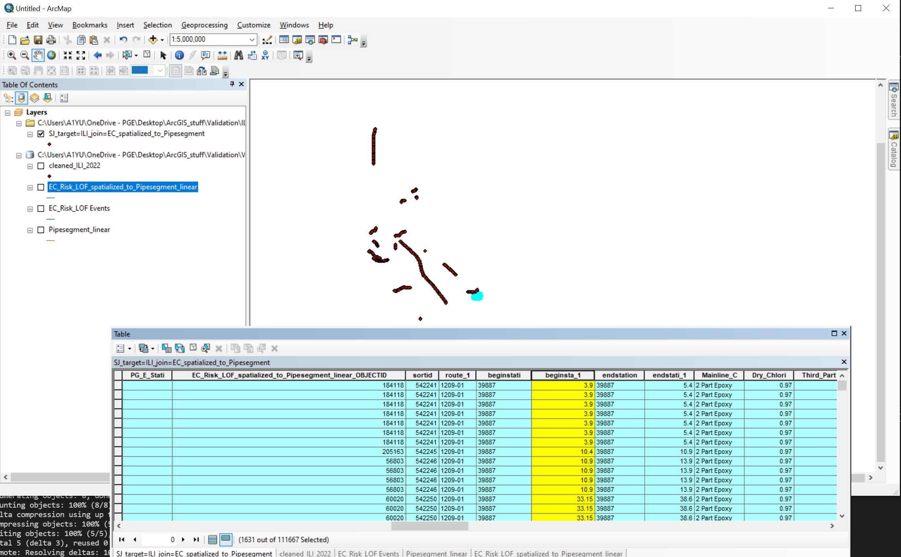
9. We can check that the segments in the EC_Risk_LOF table are properly joined with the ILI anomalies by selecting all rows with the same `beginstationseriesid` (39887 in screenshot), sorting the `beginstationum` and check the correspondence between the different attribute tables (shown in screenshot).

## Going over data flow audit with Kiana

Try to do data set aggregation summary. See [slides](https://pge-my.sharepoint.com/:p:/p/a1yu/EbzvfKsD3o9DohLAGSyBFCcB6HFnWQsofN7WYjRwm9MLrw?e=vB26Ir) for instructions and the framing of the problem.

Kiana will provide a list of raw and intermediate datasets, which we can prioritize for Foundry ingestion based on degree of dependences. I can then use this to provide recommendations for Foundry team next year.

# Week of 1/29/2024

First update of the new year!

## Kiana's data flow audit and ingestion recommendation

Compiled data source/flow [spreadsheet](https://pge.sharepoint.com/:x:/r/sites/TIMPRisk/_layouts/15/Doc.aspx?sourcedoc=%7B935B3D97-21EC-44DC-AA16-215E523330B9%7D&file=TIMP%20Risk%20Datasets%20to%20Foundry%20Recommendation.xlsx&action=default&mobileredirect=true).

The idea of this process is documented [here](./assets/data_source_audit_flow.pptx)

__Top recs:__

1. ILI Pipeline Tally, CIS Read Dataset, Leak Master
    - Part of 2023 Migration to Foundry Ontology Effort
2. H-forms from TCAT (Inspection data)
    - Feeds into 4 Factors, 6 Mariner Tables, 12 Mariner columns, 4 Locations (i.e. “Intermediate Sources”)
    - Can try to directly connect H-forms from TCAT to Foundry?
3. A-forms from SAP (Inspection data)
    - Feeds into 4 Factors, 6 Mariner Tables, 3 Mariner columns, 2 Locations (i.e. “Intermediate Sources”)
    - Can try to directly connect A-forms from SAP to Foundry?
4. GTGIS
    - Feeds into 4 Factors, 6 Mariner Tables, 3 Mariner columns, 2 Locations (i.e. “Intermediate Sources”)
    - GTGIS to Foundry ingestion is underway for certain datasets. Need to figure out which ones we need (Kiana to continue this).
5. Corrosion Program Spreadsheets
    - Feeds into 5 Factors, 4 Mariner Tables, 6 Mariner columns, 5 Locations (i.e. “Intermediate Sources”)
    - Different spreadsheets for Casing, Atmospheric Corrosion, DC Interference, and MIC. Uses Power BI for Soils data.
    - Need to figure out how these spreadsheets are derived from upstream datasets.

## Gas Data Management (GDM) and Foundry Ontology (Ontology) team

I was surprised when Gary Singh from the GDM team reached out to me about a "TIMP Risk Analytics project", which essentially wants to replicate the risk modeling process in Foundry. This is great, but the plan seemed to underestimate the efforts required by orders of magnitude, and the claims about 60% of data needed already present in Foundry doesn't seem right. Clearly there was some disconnect between the different programs...and how does this relate to all the data ingestion work the Ontology team's helping me with?

Getting GDM (Alec McCullick), Ontology team (Archana Kumari, Jayna Thanki, and others I've worked with during Foundry data ingestion), and Gordon on TIMP, we (mostly me, apparently everybody knew what's going on lol) figured out the following:

- The "TIMP analytics" project was initiated from a project proposal back in 2020/2021. As Gordon mentioned, we currently have New Century to do what was asked back then, so that proposal is now obsolete (although I'm not exactly sure what was asked).
- The normal flow of things for Foundry-related projects are:
  - Talk to GDM/Alec about some need and requirement
  - If data-ingestion related, gets routed to Foundry Ontology team
  - Do stuff...
  - In generaly GDM gate-keeps the ontology team's work stream.
- But apparently Bronson has made us special and TIMP gets blanket approval with data ingestion, so:
  - If it's data PRODUCT-related, talk to Alec, it gets listed into some work prioritization list, then things proceed -- GDM figures out resources (i.e. who can help and when)
  - If it's data-ingestio related, just to to Foundry Ontology team directly, and get it fit into their work stream
- Gordon brought up the issue of asset lineage tracking in GTGIS: i.e. if part of a pipe gets replaced, it gets a different asset ID in GTGIS from the original pipeline, and we need to currently manually do snapshot comparisons to infer lineage.
  - This is doable in Foundry but would require some work.
  - This for example, is a project that can receive support from GDM, and Alec will bring this up in their "governance meeting" as a use case/product work.

### Possible GDM "Products"

Alec got interested in the GTGIS pipeline lineage issue when Gordon brought it up (as something TIMP has to fix ourselves) and wanted to explore that as a potential project.

More details on the __GTGIS pipe lineage problem__:

> tracking lineage primarily focuses on assets that didn't get replaced and stayed in the ground. They might have been split because a short replacement project or a valve install occurred in the middle. They might have been moved because Mapping made changes based on new GPS data or pipe length data. I think this is not an easy project for Froundry since there are many variables, both spatial coordinates and attribute data. For example if part of the logic is to compare attribute data to identify matching assets between two snapshots, it is possible some attributes have been updated by Mapping. Currently we do a purely spatial matching for most uses, but for manufacturing threat we also try to match pipeline feature number, but sometimes these get updated by Mapping and that throws off the comparison.

So I think the right way to approach is to consider:
1. Under what circumstances can pipe lineage be broken? And how they can be fixed?
2. Compare the current methods/logic employed by TIMP and any other way to abstract the commonalities to find a more general solution.
3. Explore what methods are possible in Foundry and whether a general solution is possible.

Very typical problem-solving process, but as we'll be working in a new environment, it's important to make this a case study.

__Additional automation projects__

1. Structure IOC calculation:
  - > It's a very computationally intensive run and now we no long have the ability to run the FME script through the IT O&M team
2. Fatigue claculation based on the rainflow model
3. Network tracing:
  - > (for customer count, SCC temperature, and IC accumulation point) but since we don't have a full connectivity model of the system this might not be doable for the Foundry team.
4. Tracking and possibly correcting PFL feature number issue:
  - > that would really help with manufacturing data ingestion since that threat relies so much on linking feature numbers with input data

Gordon also listed two great resources:

1. [TIMP 2022 Functional Technical Design Document](https://pge-my.sharepoint.com/:w:/p/ghy1/EY1sggIVpIVCi1GMUd8b6GIBt4vTSf5ng4NJzifQeA8zJQ?e=CQmLFF):
    - The specific project is __`Data Loader for TIMP Quantitative Risk Model Enhancement 2022`__
    - Contains all the FME script requirements for pre-processing data to/from MarinerDB
    - #TODO: Are these scripts we currently use? Are they used with New Century tool?
2. [Risk assessment factor calculations](file://ffshare01-nas/RiskMgmt/RISK%20THEMES/2023/2023%20Risk%20Assessment/RMI-02/):
    - These files document how different factors involved in the risk model are calculated, describes the datasets used, how they are processed, the calculations involved and associated rationale.
    - #TODO: If we can essentially replicate the described functions in Foundry, does that mean we have replicated the risk modeling process then?

On possibly moving all the risk process into Foundry, naturally Gordon has some resevations since we recently invested a lot into the New Century tool. And On the question of if we can replicate the described FME scripts in Foundry, whether that means we have replicated the risk modeling process, Gordon explains:

> The FME scripts are still used, but in 2023 I had to use ArcGIS scripting to do 22 scripts since the IT O&M team did not have the ability to make tweaks and fix issues in FME, unlike prior years when we had the funding for a dedicated IT FME team. We want to retire the FME processing entirely within a year or two.

> The New Century tool will be able to incorporate some of the simpler FME scripts into the risk/threat models, this has the benefit of being able to run end to end updates with the push of a button. However the New Century system will not be able to run the most complex logic like the ones I mentioned (don't know exactly where the cutoff is at this point). Therefore Foundry is a good place to re-program these processing logic. There is a timing requirement: our internal team needs to be able to make logic updates fairly quickly to meet the timing of the annual compliance risk run.

> If all the FME scripts are processed by Foundry, building a risk model on top of these data tables would basically be duplicating the New Century models. However, there are benefits of the New Century tool that Foundry may not have. The New Century tool allows scenario analysis (i.e. change of MAOP, pipe specs, or simulating data improvement), and also allows any engineer who has the software to make logic changes as a way to pilot new ideas. Another benefit that comes with the New Century platform are the alignment sheet (maps with data tables) and dashboard tools

> I also have doubts about the level of cost for Foundry and the ability of our team to have full and quick ability to make changes (i.e. schema changes and logic changes). Our compliance timing requires this flexibility. Another significant issue is whether Foundry can do dyanmic segmentation at all. This is a deal breaker - not having this ability means it will not do what the New Century tool can.

> New Century has an ongoing contract for 2024. Support will probably be on demand in the future. My plan is to do the rest of the feasible FME scripts on the New Century platform ourselves, following the 6 examples they develop this year. The New Century support contract is very reasonably priced too. I don't see the benefit of spending on Foundry to duplicate the work (waste elimination means no duplication), if TIMP will be on the hook for the software developer cost.

> I see the role of Foundry in sharing our risk results to execution and other downstream teams, and cleaning up input data if there is need to improve data quality.

- Everyone can agree that Foundry is a good place for data integration, but not necessarily for running the risk process throught.
- The reservations are due to development ease and extra cost.
- This all makes sense, and it will be a gradual process to migrate the risk modeling workflows without breaking things.
- At the minimum, we need to enable New Century to be able to talk to Foundry, which is certainly doable.


__My assessment of roadmap for Foundry-based risk process__

There are primarily three things we need for this to work:
1. **Data ingestion of primary sources**: This deals with identifying the upstream primary data sources (A-form, H-form, GTGIS, ILI tally, etc) that are needed, and ingesting them into Foundry in a way such they are complete, reusable, and easy to check correctness and integrity.
2. **Transformation to intermediate datasets from primary sources**: This deals with data cleaning (i.e. GTGIS pipe lineage tracking, Leakmaster, center-line alignment) and preprocessing that's needed. This will often start to involve combination of multiple datasets.
    - We can consider this step as "products" already. But their outputs aren't directly actionable products (i.e. lineage tracking INDIRECTLY serve business purpose and field actions).
    - This should be a separate phase but the pipeline building and validation process can be significant.
3. **Final actionable analytics product**: Results of these pipelines are directly actionable, such as risk model scores leading to field work.
    - The end results are often subject to compliance and regulations.
    - > other pipeline operators using Foundry to do subpart O compliance work with models similar to ours in terms of the kinds of data used.

As an example, the different phases of the leakmaster dataset ingestion/replication [process](##LeakMasterUpdateDec2023) can be seen to involve both (1) and (2).

## Actionables:

__Foundry-related:__
- Check in Foundry if existing ontology/datasets (i.e. H-form, A-form, GTGIS tables) are sufficient.
    - Target EC model use cases: Get Kiana help here too
    - Use Collibra to check dataset description metadata.
        - Collibra: Ask Matt Siegmund for access. Example to follow
    - Deadline: 2/16/2024
- Start work on building corrosion volumetric loss results in Foundry from ILI data.
  - Talk to Satvinder about using the same spatial overlay?
  - Onboard Kiana here too
  - Deadline: 2/16/2024
- Figure out prioritization for automating modeling processes in Foundry -- which ones to prioritize?
  - Meeting with GDM/Alec

__Modeling-related:__
- Finish compiling EC model-performance results for steering committee: go through a few more years' data, high priority
  - Deadline: 2/9/2024

__Direction:__
- Make slides about probabilistic modeling course learnings:
  - Deadline: 2/23/2024
- Write roadmap/strategy for automating risk modeling, model measurement, and data-driven models. Have Gordon help with this.
  - Deadline: 2/23/2024


# Week of 2/5/2024

Update on actionables from last week, and additions:

__Foundry-related:__
- Check in Foundry if existing ontology/datasets (i.e. H-form, A-form, GTGIS tables) are sufficient.
    - Target EC model use cases: Get Kiana help here too
    - Use Collibra to check dataset description metadata.
        - ~~Collibra: Ask Matt Siegmund for access. Example to follow~~
        - Collibra currently still lacking many dataset descriptions, their team is under-water, help when they reach out.
          - Satvinder passed along the ILI column description to them
    - __GTGIS tables__: Kiana has compiled from Gordon a list of tables that our current risk process uses. But the way risk model process address get this data is through querying the snapshot stored on TIMP Oracle DB. Need to work out how to cross-check the tables in there vs. in Foundry
      - Figure out Snapshot process, contact Brian P. (what's last name?)
    - __H Forms__: Check out the datasets in Foundry, make sure they are validated and QC'd.
    - __Deadline:__ 2/16/2024
- Start work on building corrosion volumetric loss results in Foundry from ILI data.
  - Talk to Satvinder about using the same spatial overlay?
  - Onboard Kiana here too
  - __Deadline:__ ~2/16/2024~, 2/23/2024
- Figure out prioritization for automating modeling processes in Foundry -- which ones to prioritize?
  - ~~Meeting with GDM/Alec~~
  - Give GDM/Alec a list of dataasets I need them to ingest, along with the descriptions.
  - __Deadline:__ 2/23/2024

__Modeling-related:__
- Finish compiling EC model-performance results for steering committee: go through a few more years' data, high priority
  - Deadline: 2/9/2024

__Direction:__
- Make slides about probabilistic modeling course learnings:
  - __Deadline:__ 2/23/2024
- Write roadmap/strategy for automating risk modeling, model measurement, and data-driven models. Have Gordon help with this.
  - __Deadline:__ ~~2/23/2024~~ 3/2/2024

__Misc:__
- Have a retro doc about Foundry ingestion process from last year
- Make a document compiling all the new dataset resources and references.


## Other notes:

### EC Modeling ideas

Chris Warner is interested in doing more data-drive EC risk modeling. Need to think about more ways to improve in this direction.

1. 2SD corrosion criteria -- this is about to be implemented
2. [Idea from Ian] Measuring data coverage: What percentage of pipelines are present in what datasets?
3. [Idea from Ian] "Measure performance of the dataset":
  - Compare the consistency between different EC datasets, assuming ground-truth of H-form and ILI.
  - But this analysis can suffer from confounds though (e.g. anodic protection dataset is only accurate in wetter areas, so it'll involve mechanistic modeling to account for this.)
4. What other (possibly shakier) risk modeling assumptions can we examine?
    - Mitigation factors: How do they actually impact risk scores? For example, does ECDA provide any value compared to hydrotest? What are the effectiveness of each?
      - This is important because knowing e.g. effectivness of ECDA vs. hydrotest can change budge request requirement.


# Week of 2/12/2024

## EC Model Performance continued

### Redo the process for 2021

Outlining procedures briefly for this entire workflow:

1. Extract ILI tally entries corresponding to 2021.
    - Originally tried using Foundry, but I don't have permission to download the filtered data. And apparently data can only be downloaded 10k rows at a time (there are 30k+ rows for 2021), so not great.
    - Ended up reusing my [notebook](https://github.com/allenyin-pge/ModelPerformance/blob/master/segmenting_ILI_excel_sheet.ipynb) instead to do it locally from the `All_ILIData.csv` instead.
    - Saved it somewhere as `cleaned_ILI_2021.csv`.
2. Copy over 2021's data prep ArcMap database:
    - Copy 2021's geodatabase: `\\rcnas01-smb\sysintegrity-fs01\SysIntegrity\RiskMgmt\SI\SME_Tables_RiskAnalysis\QRAD_2021\Validation\` to local folder.
    - Name it `...\ModelValidation2021`.
    - In the catalog pane of Arcmap, add that folder under `Folder Connections`.
3. Expand `...\ModelValidation2021\ValidationData.gdb`, and drag `Pipesegment_linear` layer to the content pane. This will render the pipe segments as lines.
4. Create `...\ModelValidation2021\ILI_data`, copy over the previously created `cleaned_ILI_2021.csv`.
    - Now in ArcMap, we can drag the `...\ModelValidation2021\ILI_data\cleaned_ILI_2021.csv` to the content pane.
    - Right click the csv file, then `Display as X/Y Data`. choose `longitude` as `X`, `latitude` as `Y`. Then click `Edit` and pick `Geographic coordinate system -> World -> WGS84`.
    - This will then overlay the ILI anomaly as points on top of the `Pipesegment_linear` layer as points.
5. Right click on the `cleaned_ILI_2021.csv Events`, then `Data -> Export Data`. In the menu, chose the `Source data` coordinate system, and save it as shapefile in `...\ModelValidation2021\ILI_data\cleaned_ILI_2021.shp`.
    - It's important to choose `Source data` coordinate system. Choosing `Data Frame` option ended up making the saved feature class offset from the original coordinates, and subsequent spatial joins will fail.
6. Connect to MarinerDB2021:
    - Assume SQL database for MarinerDB are established (search notes for "Get access to data base" for info)
    - In ArcMap catalog pane, click `Database connections -> Add Database Connection`
    - Chose `tsitinfdbsws008`, and use `Operating System Authentication` for authentication
    - In `Database` dropdown, wait for it to populate and then choose `MarinerDB_2021`.
7. In the `MarinerDB2021`, right click the table `MarinerDB_2021.dbo.EC_Risk_LOF`, then `Export > To Geodatabase (Single)`. Then in the resulting diaglog choose the Folder connection's `ValidationData.gdb` as the source.

Now follow all the steps in "Week of 12/19/2023, Work on Performance Metrics"

For 2021, the step of spatial joining `EC_Risk_LOF_Events` (line features) to `cleaned_ILI_2021` (point features) using the dialog from layer context menu (i.e. right click on the `cleaned_ILI_2021` layer, also so [this](https://support.esri.com/en-us/knowledge-base/bug-spatial-join-with-large-datasets-fails-to-complete-000009130)) fails because there are too many rows in the tables.

Instead, go to `Geoprocessing -> Search for tools`, type in `Spatial Join` and pick that. The parameters are:
- Target = `cleaned_ILI_2021` layer
- Join feature = `EC_Risk_LOF_Events` layer
- Join type = `JOIN_ONE_TO_ONE` (convert ILI data to NAD 1983 coord?)
- Match option = ~~`INTERSECT`~~, `CLOSEST`
- Save to `ValidationData.gdb`

Note if the spatial join results frequently have the columns from the target features missing, this might indicate a coordinate problem. Check for this by drawing both the target and join feature classes and see if they actually overlap!

Notes about weird things that can happen:
1. **Missing stationing variables in spatial-joined result**: Sometimes we have rows with no stationing variables, this is when ILI and EC_LOF table don't overlap. Usually these rows correspond to ILI entries where the longitude/latitude in ILI data is invalid (i.e. all 0's). You can check these by looking into the corresponding entries in the original data table or file.
2. **Total ILI distance calculations**: After spatial-joining the EC_LOF values to ILI, for each ILI anomaly entry, it's assigned the EC_LOF table's attribute values corresponding to the EC_LOF dynamic segment including said anomaly.
    - Method1: Calculate total ILI distance from unique route mile marker (`route`, `MP1`, `MP2`) from ILI tally (how Satvinder calculates total ILI distance for a given year). Note the units here are in miles.
    - Method 2: Calculate total ILI distance based on `(beginstationseriesid, beginstationnum, endstationnum)` from risk model's dynamic segment. The distance (`endstationnum - beginstationnum`) unit is in feet, REMEMBER to convert to miles after summing!
    - Method 1 result doesn't have to be the same as Method 2, rather `result_method1 >= result_method2`, for the following reasons:
      - During ILI, the inspection does different segments of a route. Each continuous segment of route inspected is identified by the MP1 and MP2 values on that route.
      - Each anomaly entry in ILI happens within one of these continuous segments.
      - EC Risk table uses stationing to identify segments of pipes, these can be of finer resolution compared to the continuously inspected segments.
      - So when the distance calculated from the stationing variables assigned to each anomaly is LESS than that calculated from the ILI MP1/MP2 values, that means there are significant chunks of inspected pipes where there are no anomaly found.


                                                               